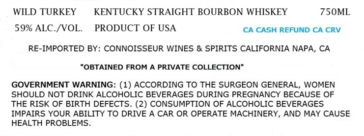
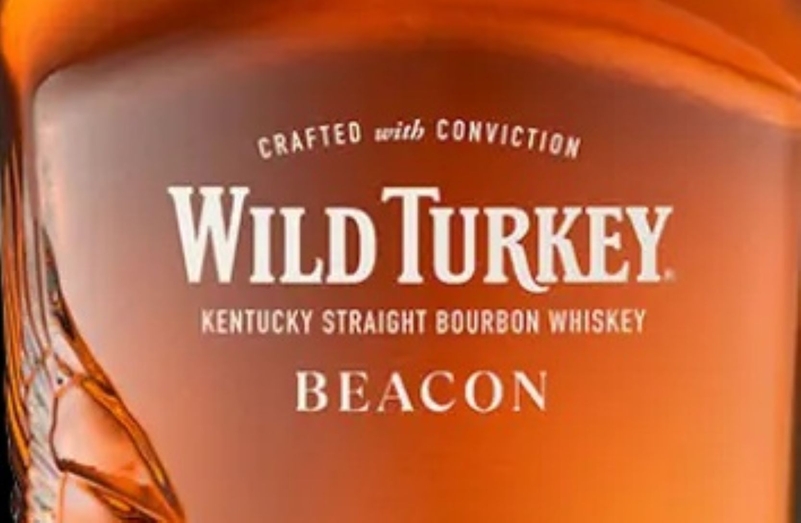

# TTB COLA Label Images - TTBID 26192001000039

**Brand Name:** WILD TURKEY

**Fanciful Name:** BEACON

**Issue Date:** 07/14/2026

**Origin Code:** 01

**Product Class/Type:** 101

**Source:** [TTB Public COLA Registry](https://ttbonline.gov/colasonline/viewColaDetails.do?action=publicFormDisplay&ttbid=26192001000039)

## Label Images

### Label 1

### Label 2

## Extracted Label Text

*Text extracted via OCR - may contain errors*

**Detected Proof:** 118

### Label 1

WILD TURKEY
KENTUCKY STRAIGHT BOURBON WHISKEY
750ML
59% ALC /VOL
PRODUCT OF USA
CA CASH REFUND CA CRV
RE-IMPORTED BY: CONNOISSEUR WINES & SPIRITS CALIFORNIA NAPA, CA
"OBTAINED FROM A PRIVATE COLLECTION"
GOVERNMENT WARNING: (1) ACCORDING TO THE SURGEON GENERAL, WOMEN
SHOULD NOT DRINK ALCOHOLIC BEVERAGES DURING PREGNANCY BECAUSE OF
THE RISK OF BIRTH DEFECTS. (2) CONSUMPTION OF ALCOHOLIC BEVERAGES
IMPAIRS YOUR ABILITY TO DRIVE A CAR OR OPERATE MACHINERY, AND MAY CAUSE
HEALTH PROBLEMS

### Label 2

Iith
Wild TuRKEY
KENTUCKY StraIGHT BOURBON WHISKEY
BEACON
comviction
crafted
