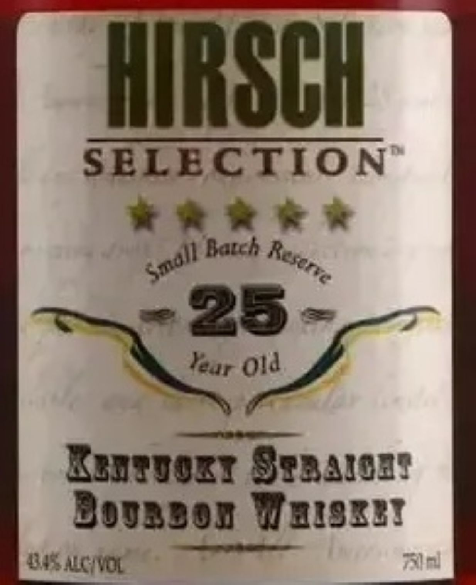
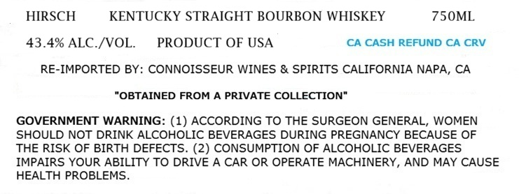

# TTB COLA Label Images - TTBID 26192001000044

**Brand Name:** HIRSCH

**Fanciful Name:** 25 YEAR OLD

**Issue Date:** 07/14/2026

**Origin Code:** 01

**Product Class/Type:** 101

**Source:** [TTB Public COLA Registry](https://ttbonline.gov/colasonline/viewColaDetails.do?action=publicFormDisplay&ttbid=26192001000044)

## Label Images

### Back Label

### Label 1

## Extracted Label Text

*Text extracted via OCR - may contain errors*

**Detected Proof:** 86.8

### Back Label

HIRSCH
SELECTION
Datch
25
KznIvozT 87a4,0BF
Bogsbob WzIBEZI
WsCIOL
Tal
Resarve
Small
Yeur
0ld

### Label 1

HIRSCH
KENTUCKY STRAIGHT BOURBON WHISKEY
750ML
43.4% ALC /VOL_
PRODUCT OF USA
CA CASH REFUND CA CRV
RE-IMPORTED BY: CONNOISSEUR WINES & SPIRITS CALIFORNIA NAPA, CA
"OBTAINED FROM A PRIVATE COLLECTION"
GOVERNMENT WARNING: (1) ACCORDING TO THE SURGEON GENERAL, WOMEN
SHOULD NOT DRINK ALCOHOLIC BEVERAGES DURING PREGNANCY BECAUSE OF
THE RISK OF BIRTH DEFECTS. (2) CONSUMPTION OF ALCOHOLIC BEVERAGES
IMPAIRS YOUR ABILITY TO DRIVE A CAR OR OPERATE MACHINERY, AND MAY CAUSE
HEALTH PROBLEMS
