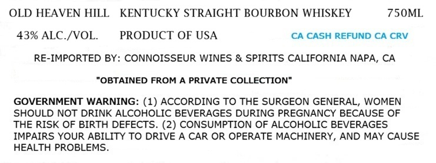
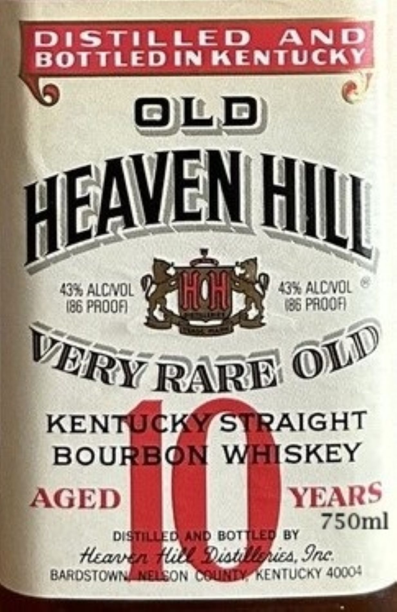

# TTB COLA Label Images - TTBID 26192001000047

**Brand Name:** OLD HEAVEN HILL

**Fanciful Name:** AGED 10 YEARS

**Issue Date:** 07/14/2026

**Origin Code:** 01

**Product Class/Type:** 101

**Source:** [TTB Public COLA Registry](https://ttbonline.gov/colasonline/viewColaDetails.do?action=publicFormDisplay&ttbid=26192001000047)

## Label Images

### Label 1

### Label 2

## Extracted Label Text

*Text extracted via OCR - may contain errors*

**Detected Proof:** 86

### Label 1

OLD HEAVEN HILL
KENTUCKY STRAIGHT BOURBON WHISKEY
75OML
43% ALC /VOL
PRODUCT OF USA
CA CASH REFUND CA CRV
RE-IMPORTED BY: CONNOISSEUR WINES & SPIRITS CALIFORNIA NAPA, CA
"OBTAINED FROM A PRIVATE COLLECTION"
GOVERNMENT WARNING: (1) ACCORDING TO THE SURGEON GENERAL, WOMEN
SHOULD NOT DRINK ALCOHOLIC BEVERAGES DURING PREGNANCY BECAUSE OF
THE RISK OF BIRTH DEFECTS. (2) CONSUMPTION OF ALCOHOLIC BEVERAGES
IMPAIRS YOUR ABILITY TO DRIVE A CAR OR OPERATE MACHINERY, AND MAY CAUSE
HEALTH PROBLEMS

### Label 2

DIStilled
AND
BOTTLED IN KENTUCKY
OLD
HEAVEN HILL
4*AlcnoL
437 NCNOL
I86 PaoOA
65 PaqIA
RARE
KENTUCK
STRAIGHT
BOURBON
WHISKEY
AGED
YEARS
750ml
DISMILLLED AND BotTLED BY
Huavn
Diatilisnea, Inc
BaRDSTOMN
KPCCON Ceu
'RENTUCKY 4000:
OLD
VERY
