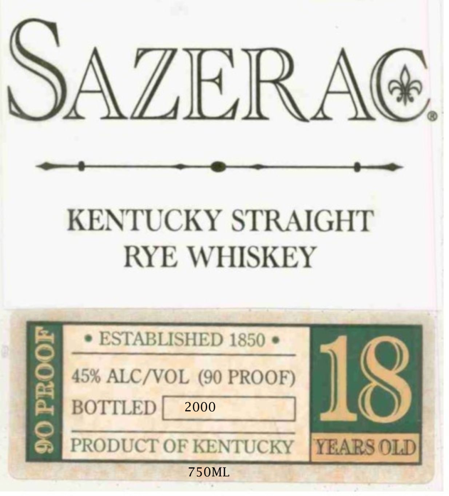

# TTB COLA Label Images - TTBID 26192001000050

**Brand Name:** SAZERAC

**Fanciful Name:** 18 YEAR OLD

**Issue Date:** 07/24/2026

**Origin Code:** 00

**Product Class/Type:** 102

**Source:** [TTB Public COLA Registry](https://ttbonline.gov/colasonline/viewColaDetails.do?action=publicFormDisplay&ttbid=26192001000050)

## Label Images

### Label 1

### Label 2

## Extracted Label Text

*Text extracted via OCR - may contain errors*

**Detected Proof:** 90

### Label 1

SAZERA
KENTUCKY STRAIGHT
RYE WHISKEY
ESTABLISHED 1850
8
45% ALCNVOL (90 PROOF)
I18
BOTTLED
2000
8
PRODUCT OF KENTUCKY
YEARS OLD
750ML

### Label 2

RE-IMPORTED BY: CONNOISSEUR WINES & SPIRITS CALIFORNIA NAPA,CA

"OBTAINED FROM A PRIVATE COLLECTION"

CACASHED REFUND CACRV

GOVERNMENT WARNING: (1) ACCORDING TO THE SURGEON GENERAL, WOMEN

SHOULD NOT DRINK ALCOHOLIC BEVERAGES DURING PREGNANCY BECAUSE OF THE

RISK OF BIRTH DEFECTS. (2) CONSUMPTION OF ALCOHOLIC BEVERAGES IMPAIRS YOUR

ABILITY TO DRIVE A CAR OR OPERATE MACHINERY, AND MAY CAUSE HEALTH PROBLEMS.
