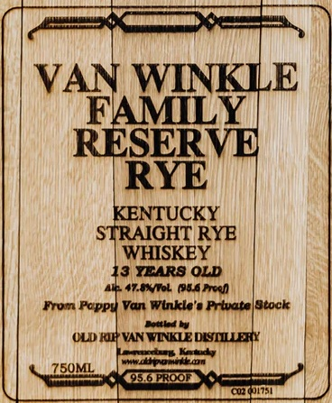

# TTB COLA Label Images - TTBID 26192001000069

**Brand Name:** VAN WINKLE

**Fanciful Name:** FAMILY RESERVE

**Issue Date:** 07/17/2026

**Origin Code:** 01

**Product Class/Type:** 101

**Source:** [TTB Public COLA Registry](https://ttbonline.gov/colasonline/viewColaDetails.do?action=publicFormDisplay&ttbid=26192001000069)

## Label Images

### Label 1

### Label 2

## Extracted Label Text

*Text extracted via OCR - may contain errors*

**Detected Proof:** 95.6
**Detected Age:** 13 Years

### Label 1

VAN WINKLE
FAMILY
RESERVE
RYE
KENTUCKY
STRAIGHT RYE
WHISKEY
13 YEARS OLD
a7.5knoL (14 Frcen
Fron Pappy Van Wlkke-
Prhatelitock
ULD RIl} VAN VEKLEDISTLLEAY
Kath
Fiiodnt
Z5OML
95.6 PROOF
60274n175

### Label 2

RE-IMPORTED BY: CONNOISSEUR WINES & SPIRITS CALIFORNIA NAPA,CA

"OBTAINED FROM A PRIVATE COLLECTION"

CACASHED REFUND CACRV

GOVERNMENT WARNING: (1) ACCORDING TO THE SURGEON GENERAL, WOMEN

SHOULD NOT DRINK ALCOHOLIC BEVERAGES DURING PREGNANCY BECAUSE OF THE

RISK OF BIRTH DEFECTS. (2) CONSUMPTION OF ALCOHOLIC BEVERAGES IMPAIRS YOUR

ABILITY TO DRIVE A CAR OR OPERATE MACHINERY, AND MAY CAUSE HEALTH PROBLEMS.
