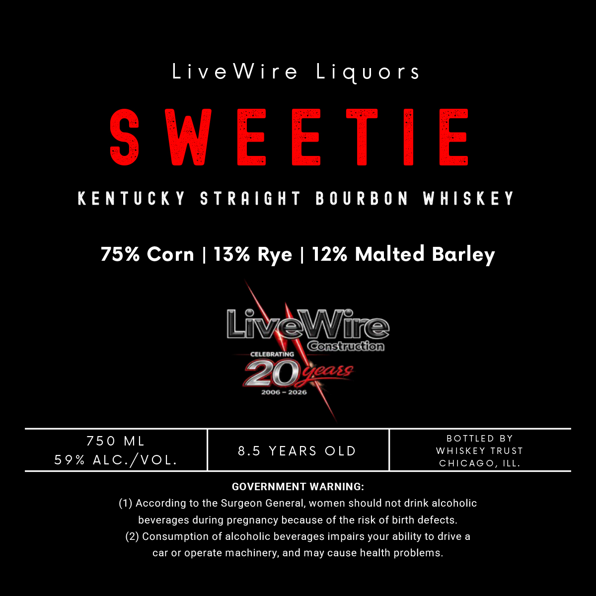

# TTB COLA Label Images - TTBID 26192001000077

**Brand Name:** LIVEWIRE LIQUORS

**Issue Date:** 07/14/2026

**Origin Code:** 22

**Product Class/Type:** 101

**Source:** [TTB Public COLA Registry](https://ttbonline.gov/colasonline/viewColaDetails.do?action=publicFormDisplay&ttbid=26192001000077)

## Label Images

### Label 1

## Extracted Label Text

*Text extracted via OCR - may contain errors*

**Detected Proof:** 118
**Detected Age:** 8.5 Years

### Label 1

LiveWire Liquors

SWEETIE

KENTUCKY STRAIGHT BOURBON WHISKEY

75% Corn | 13% Rye | 12% Malted Barley

EP

2006-2026 \

750 ML BOTTLED BY
8.5 YEARS OLD WHISKEY TRUST
59% ALC./VOL. CHICAGO, ILL.

GOVERNMENT WARNING:
(1) According to the Surgeon General, women should not drink alcoholic
beverages during pregnancy because of the risk of birth defects.
(2) Consumption of alcoholic beverages impairs your ability to drive a
car or operate machinery, and may cause health problems.
