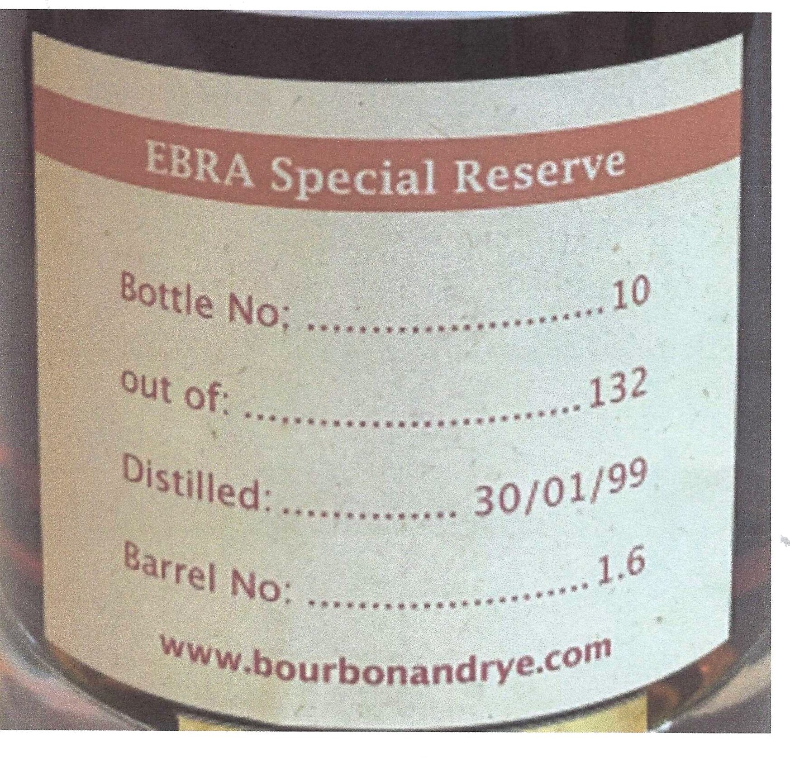
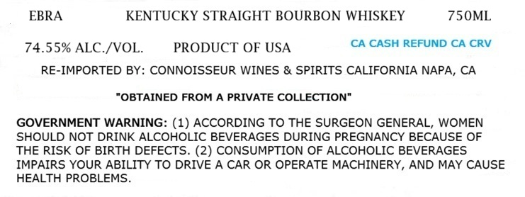
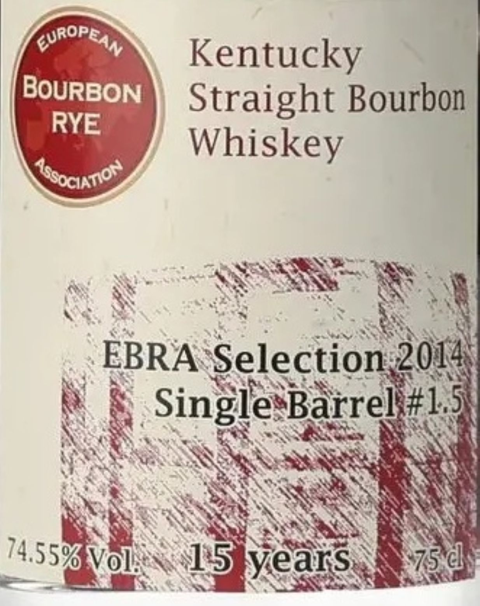

# TTB COLA Label Images - TTBID 26192001000081

**Brand Name:** EBRA

**Fanciful Name:** SINGLE BARREL 1.5

**Issue Date:** 07/14/2026

**Origin Code:** 01

**Product Class/Type:** 101

**Source:** [TTB Public COLA Registry](https://ttbonline.gov/colasonline/viewColaDetails.do?action=publicFormDisplay&ttbid=26192001000081)

## Label Images

### Back Label

### Label 1

### Label 3

## Extracted Label Text

*Text extracted via OCR - may contain errors*

*1 image(s) excluded: text did not meet readability threshold*

**Detected Proof:** 149.1

### Label 1

EBRA
KENTUCKY STRAIGHT BOURBON WHISKEY
75OML
74.55% ALC /VOL.
PRODUCT OF USA
CA CASH REFUND CA CRV
RE-IMPORTED BY: CONNOISSEUR WINES & SPIRITS CALIFORNIA NAPA, CA
"OBTAINED FROM A PRIVATE COLLECTION"
GOVERNMENT WARNING: (1) ACCORDING TO THE SURGEON GENERAL, WOMEN
SHOULD NOT DRINK ALCOHOLIC BEVERAGES DURING PREGNANCY BECAUSE OF
THE RISK OF BIRTH DEFECTS. (2) CONSUMPTION OF ALCOHOLIC BEVERAGES
IMPAIRS YOUR ABILITY TO DRIVE A CAR OR OPERATE MACHINERY, AND MAY CAUSE
HEALTH PROBLEMS

### Label 3

ROPE ;
ame Kentucky
Ree Straight Bourbon
| / Whiskey
a YO RES 4
: ae c +) ; e < ah Nt
‘ EBRA ‘Selection, coh
SaaS 0 SA SS > Te se
© & SinglesBarreli#l.3}
Noa oe SERS BE
Ny TARE ES Sag SRR ‘* & :
BRal SERIE NUNES
wh ASS AAS PAE
ASSVOIN  PSPVCARS RIG
