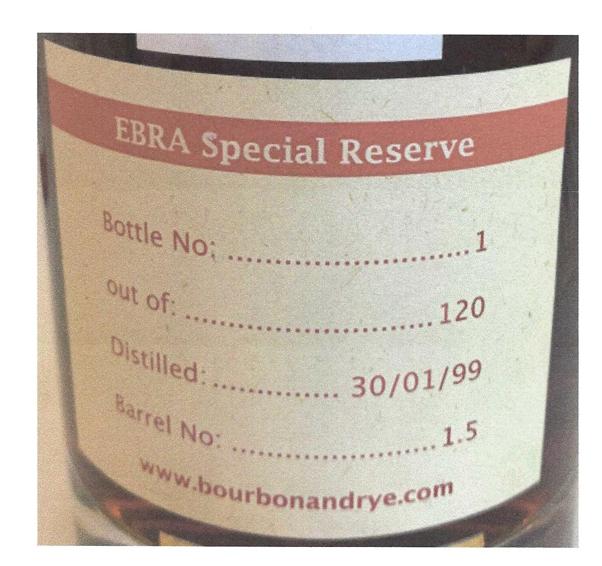
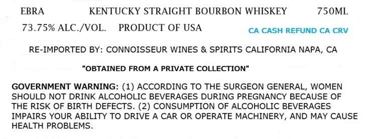
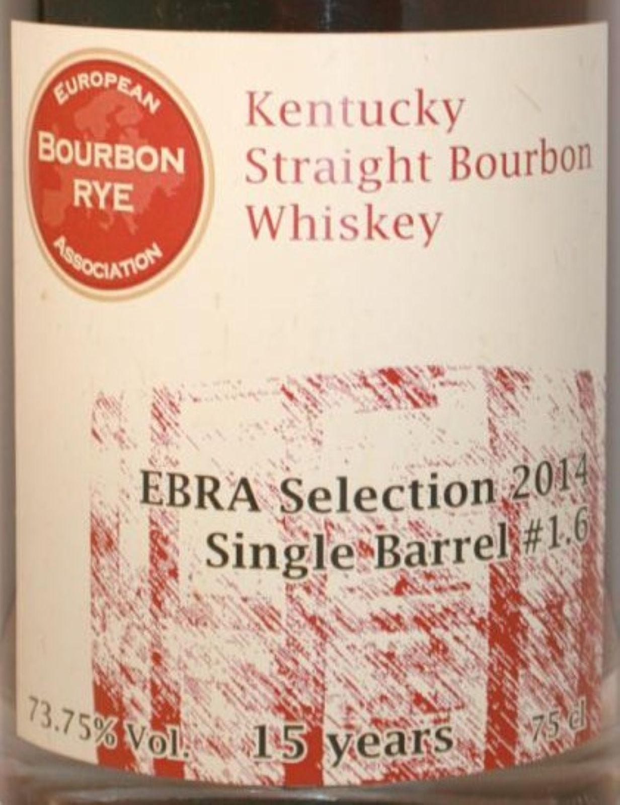

# TTB COLA Label Images - TTBID 26192001000084

**Brand Name:** EBRA

**Fanciful Name:** SINGLE BARREL 1.6

**Issue Date:** 07/17/2026

**Origin Code:** 01

**Product Class/Type:** 101

**Source:** [TTB Public COLA Registry](https://ttbonline.gov/colasonline/viewColaDetails.do?action=publicFormDisplay&ttbid=26192001000084)

## Label Images

### Back Label

### Label 1

### Label 2

## Extracted Label Text

*Text extracted via OCR - may contain errors*

*1 image(s) excluded: text did not meet readability threshold*

**Detected Proof:** 147.5
**Detected Age:** 15 Years

### Label 1

EBRA
KENTUCKY STRAIGHT BOURBON WHISKEY
75OML
73.75% ALC /VOL
PRODUCT OF USA
CA CASH REFUND CA CRV
RE-IMPORTED BY: CONNOISSEUR WINES & SPIRITS CALIFORNIA NAPA, CA
"OBTAINED FROM A PRIVATE COLLECTION"
GOVERNMENT WARNING: (1) ACCORDING TO THE SURGEON GENERAL, WOMEN
SHOULD NOT DRINK ALCOHOLIC BEVERAGES DURING PREGNANCY BECAUSE OF
THE RISK OF BIRTH DEFECTS. (2) CONSUMPTION OF ALCOHOLIC BEVERAGES
IMPAIRS YOUR ABILITY TO DRIVE A CAR OR OPERATE MACHINERY, AND MAY CAUSE
HEALTH PROBLEMS

### Label 2

Kentucky
Straight Bourbon
Whiskey
((ocuxnor
EBRA Selection
Single
15 years
(NropeaN
BourBON
RYE
2014
#L.6
Barrel
73.75%
75 d
Voll
