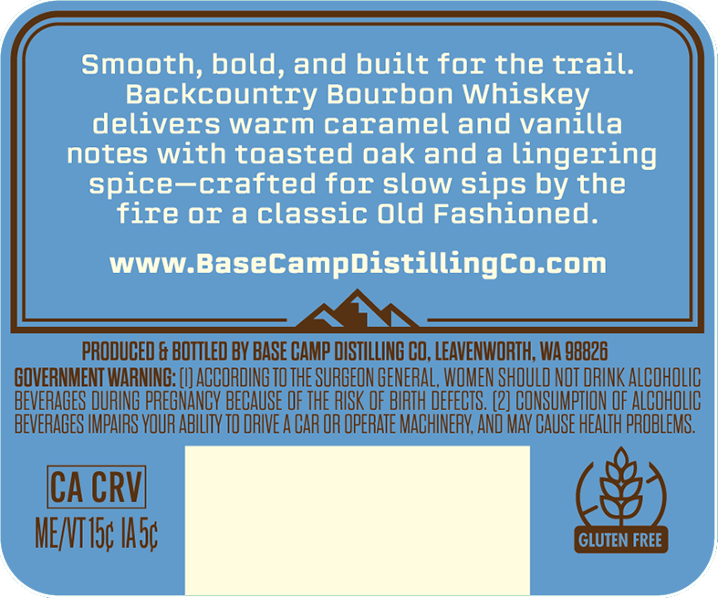
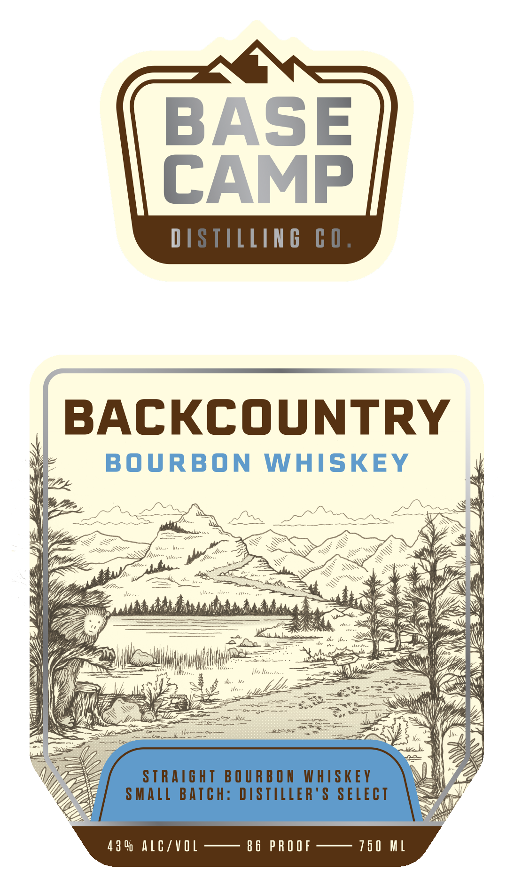

# TTB COLA Label Images - TTBID 26192001000103

**Brand Name:** BASE CAMP DISTILLING CO

**Fanciful Name:** BACKCOUNRY BOURBON WHISKEY

**Issue Date:** 07/15/2026

**Origin Code:** 07

**Product Class/Type:** 101

**Source:** [TTB Public COLA Registry](https://ttbonline.gov/colasonline/viewColaDetails.do?action=publicFormDisplay&ttbid=26192001000103)

## Label Images

### Back Label

### Front Label

## Extracted Label Text

*Text extracted via OCR - may contain errors*

*1 image(s) excluded: text did not meet readability threshold*

### Back Label

Smooth; bold, and built for the trail:
Backcountry Bourbon Whiskey
delivers warm caramel and vanilla
notes with toasted oak and a lingering
spice--crafted for slow Sips by the
fire OI a classic Old Fashioned.
WWW BaseCampDistillingco com
PRODUCED & BOTTLED BY BASE CAMP DISTILLING CO, LEAVENWORTH; WA 98826
GQVERNMENT WARNING: [V] ACCORDING TOTHE SURGEON GENERAL,WOMEN SHOULD NOT DRINK ALCOHOLIC
BEVERAGES DURING PREGNANCY BECAUSE OF THE RISK OF BIRTH DEFECTS . (2] CONSUMPTLON OF ALCOHOLIC
BEVERAGES IMPAIRS VOUR ABILTY TO RIVE A CAR OR OPERATE MACHINERY; AND MAV CAUSE HEALTH PROBLEMS.
ICA CRVI
MENTI5c Iasc
GLUTEN FREE
