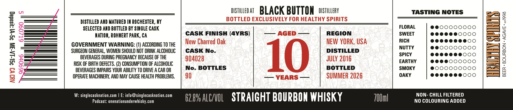
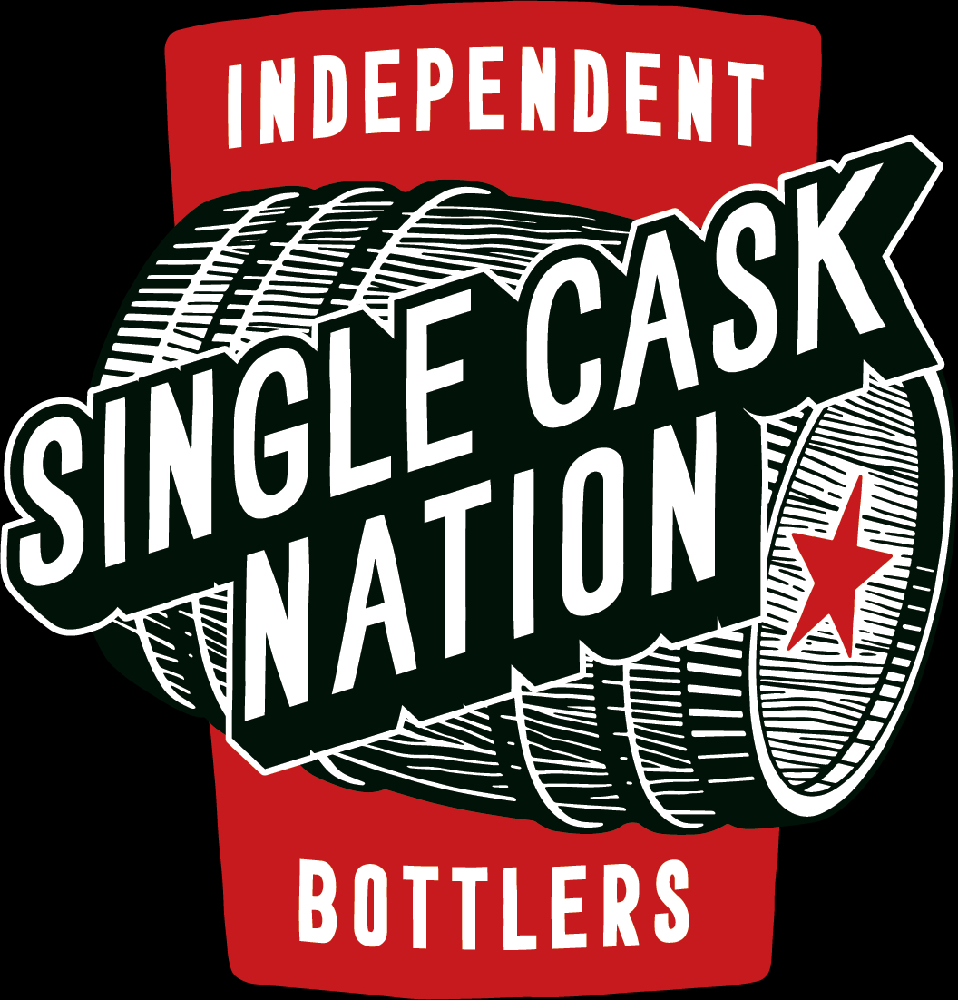

# TTB COLA Label Images - TTBID 26193001000020

**Brand Name:** SINGLE CASK NATION

**Fanciful Name:** BLACK BUTTON

**Issue Date:** 07/21/2026

**Origin Code:** 01

**Product Class/Type:** 101

**Source:** [TTB Public COLA Registry](https://ttbonline.gov/colasonline/viewColaDetails.do?action=publicFormDisplay&ttbid=26193001000020)

## Label Images

### Back Label

### Label 1

## Extracted Label Text

*Text extracted via OCR - may contain errors*

**Detected Age:** 4 Years

### Back Label

DISTLLED AT
BLACK BUTTON
DISTILLERY
TASTING NOTES
DISTILLED AND MATURED IM ROCHESTER, KY
BOTTLED EXCLUSIVELY FOR HEALTHY SPIRITS
8
6:
SELECTED AND BOTTLED BY SINGLE CASK
CASK FINISH (4YRS)
AGED
REGION
SVRA"
3
NATIOn, ROHNERT PARK, CA
New Charred Oak
NEW YORK , USA
RICH
1
GOVERNMENT WARNING: (1) ACCORDING TO THE
NUTTY
1
SURGEON GENERAL, WOMEN SHOULD NOT DRINK ALCOHOLIC
CASK No.
10
DISTILLED
SpicY
1
BEVERAGES DURING PREGNANCY BECAUSE OF THE
904028
JulY 2016
3
RISK OF BIRTH DEFECTS:. (2) CONSUMPTION OF AlcohOLIC
EARTHY
BEVERAGES IMPAIRS YOUR ABILITY TO DRIVE A CAR OR
No. BOTTLES
BOTTLED
SMOKY
6
8
OPERATE MACHINERY; AND MAY CAUSE HEALTH PROBLEMS.
90
YEARS
SUMMER 2026
OAKY
W: singlecasknation.com
E: info@singlecasknation.com
62.8# ALC/NOL
STRAICHT BOURBON WHISKY
ZOUml
NON- CHILL FILTERED
Podcast: onenationunderwhisky com
NO COLOURING ADDED

### Label 1

IMDEPENDENT
BOTTLERS
CASK
SINGLE
VNATION
