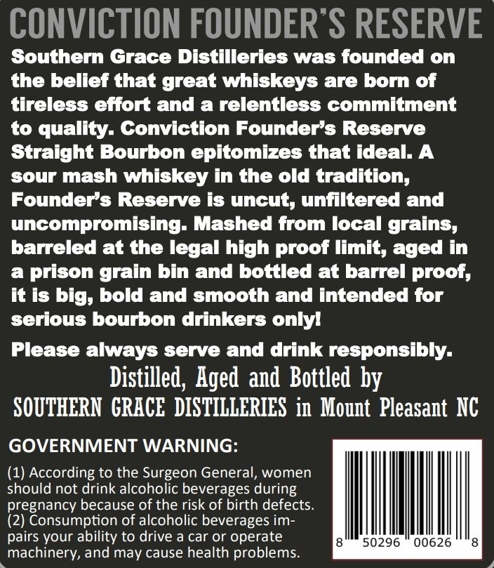
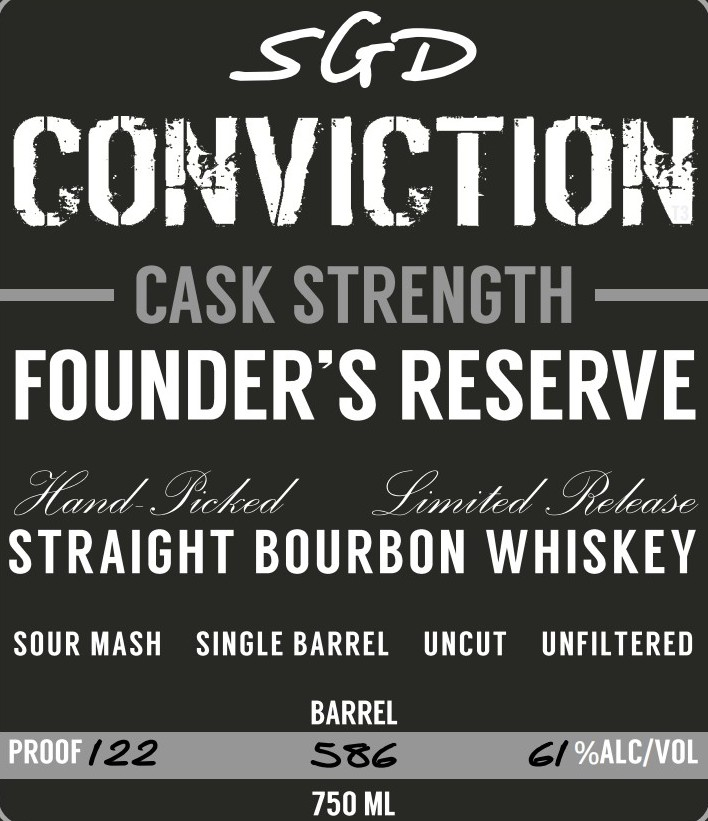

# TTB COLA Label Images - TTBID 26193001000049

**Brand Name:** CONVICTION

**Fanciful Name:** FOUNDER'S RESERVE

**Issue Date:** 07/17/2026

**Origin Code:** 35

**Product Class/Type:** 101

**Source:** [TTB Public COLA Registry](https://ttbonline.gov/colasonline/viewColaDetails.do?action=publicFormDisplay&ttbid=26193001000049)

## Label Images

### Back Label

### Front Label

### Label 2

## Extracted Label Text

*Text extracted via OCR - may contain errors*

### Back Label

CONVICTION FOUNDER S RESERVE
Southern Grace Distilleries was founded on
the bellef that great whiskeys are born of
tireless effort and a relentless commitment
to quality- Conviction Founder's Reserve
Straight Bourbon epitomizes that ideal. A
sour mash whiskey in the old tradition,
Founders Reserve is uncut, unfiltered and
uncompromising- Mashed from Iocal grains,
barreled at the legal high proot limit, aged in
a
prison grain bin and bottled at barrel proof;
it is big, bold and smooth and intended for
serious bourbon drinkers onlyl
Please always serve and drink responsibly:
Distilled, Aged and Bottled by
SOUTHERN  GRACE  DISTILLERIES in  Mount  Pleasant NC
GOVERNMENT WARNING:
(1) According to the Surgeon General, women
should not drink alcoholic beverages during
pregnancy because of the risk of birth defects_
(2) Consumption of alcoholic beverages im-
pairs your ability to drive a car or operate
50296
00626
machinery, and may cause health problems_

### Front Label

SGT
CONVICTIOH
CASK STRENGTH
FOUNDER S RESERVE
Aand_Ificked
Cmited @elease
STRAICHT BOURBON WHISKEY
SOUR MASH
SINGLE BARREL
Uncut
UNFILTERED
BARREL
PROOF ( 22
586
6i %ALCIVOL
750 ML

### Label 2

SGb
FOUNDER"S RESERVE
CONVICTION
FOUNDER S RESERVE
BOURBON
