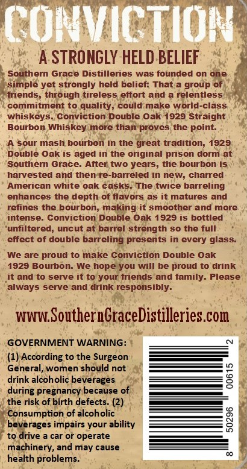
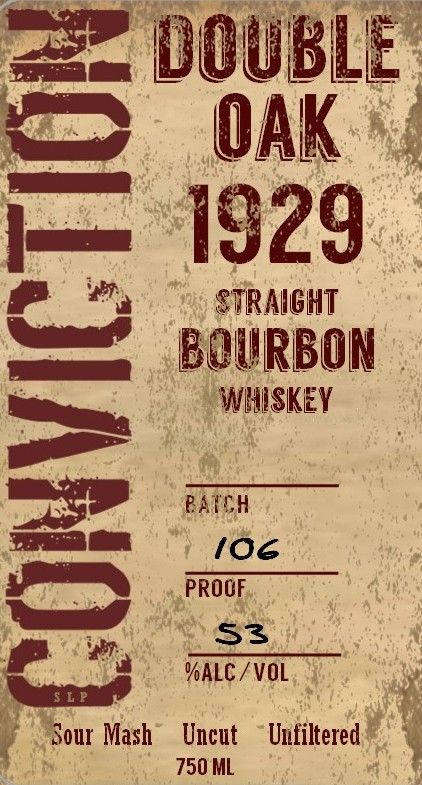
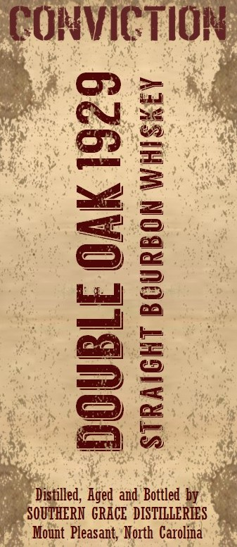
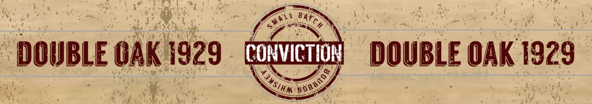

# TTB COLA Label Images - TTBID 26193001000053

**Brand Name:** CONVICTION

**Fanciful Name:** 1929 DOUBLE OAK

**Issue Date:** 07/15/2026

**Origin Code:** 35

**Product Class/Type:** 101

**Source:** [TTB Public COLA Registry](https://ttbonline.gov/colasonline/viewColaDetails.do?action=publicFormDisplay&ttbid=26193001000053)

## Label Images

### Back Label

### Front Label

### Label 2

### Label 4

## Extracted Label Text

*Text extracted via OCR - may contain errors*

### Back Label

CONVICTIOM
A STRONGLY HELD BELIEF
Southern Grace Distilleries
was founded on one
simple yet strongly held belief: That a group Of
friends
through tireless effort and a relentless
commitment t0 quality, could make world-class
whiskeys
Conviction Double Oak 1929 Straight
Bourbon Whiskey more than proves
the point:
sour mash bourbon in the great tradition; 1929
Double Oak is aged in the original prison dorm at
Southern Grace_
After two years, the bourbon is
harvested and then re-barreled in new; charred
American white oak casks
The twice barreling
enhances the depth of flavors as it matures and
refines the bourbon; making it smoother and more
intense_
Conviction Double Oak 1929 iS bottled
unfiltered; uncut at barrel strength so the full
effect of double barreling presents in every glass-
We are proud to make Conviction Double Oak
1929 Bourbon-
We hope you will be proud to drink
it and to serve it to your friends and family_
Please
always serve and drink responsibly.
WWW,SouthernGraceDistilleries com
GOVERNMENT WARNING:
(1) According to the Surgeon
General, women should not
drink alcoholic beverages
2
during pregnancy because of
the risk of birth defects. (2)
Consumption of alcoholic
beverages impairs your ability
8
to drive
car or operate
machinery, and may cause
health problems__

### Front Label

DOUBLE
OAK
1929
STRAIGHT
1
BQWBBON
PATcH
i06
PROOF
53
'ALC / VOL
Sour Mash
Uncut
Unfiltered
750 ML

### Label 2

CONvICTION
21
:
8
Distilled, Aged and Bottled by
SOUTHERN   GRECE  DISTILLERIES
Mount Pleasant; North Carolina

### Label 4

DOUBLE GAK 1929 ram DOUBLE OAK 1929
— ee arta
