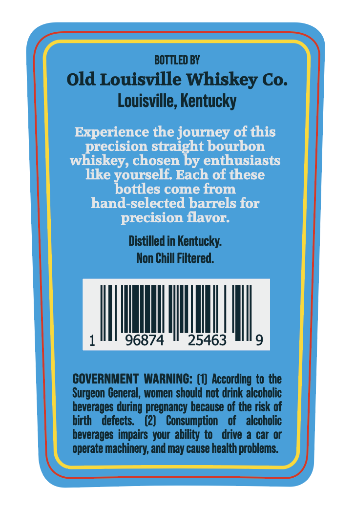
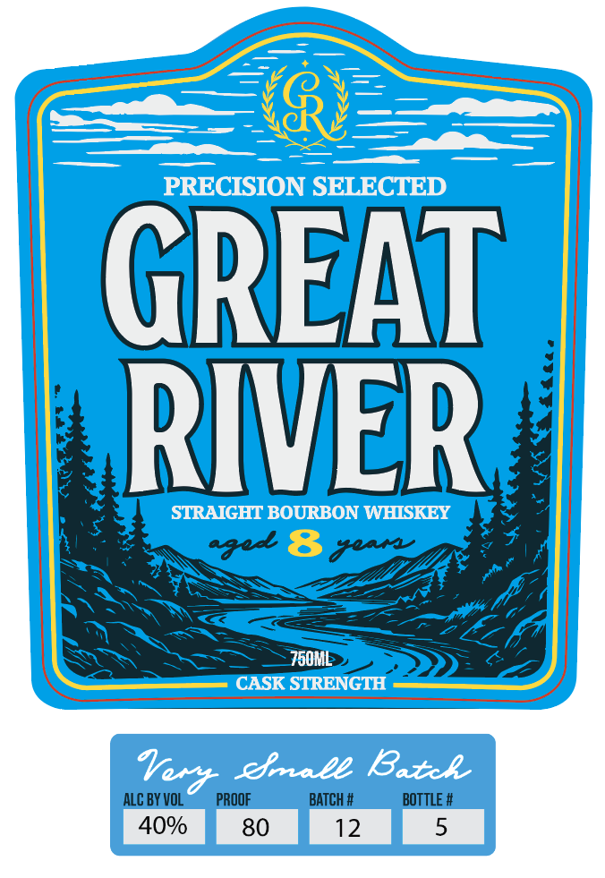

# TTB COLA Label Images - TTBID 26193001000111

**Brand Name:** GREAT RIVER

**Issue Date:** 07/14/2026

**Origin Code:** 22

**Product Class/Type:** 101

**Source:** [TTB Public COLA Registry](https://ttbonline.gov/colasonline/viewColaDetails.do?action=publicFormDisplay&ttbid=26193001000111)

## Label Images

### Back Label

### Front Label

## Extracted Label Text

*Text extracted via OCR - may contain errors*

**Detected Proof:** 80

### Back Label

BOTTLED BY
Old Louisville Whiskey Co.
Louisville, Kentucky
Experience the journey of this
precision straight bourbon
whiskey, chosen by enthusiasts
like
Each of these
'Toteelco
come from
hand-selected barrels for
precision flavor:
Distilled in Kentucky:
Non Chill Filtered.
96874
25463
9
GOVERNMENT  WARNING: (1) According to the
Surgeon General, women should not drink alcoholic
beverages during pregnancy because of the risk of
birth
defects:
(2)
Consumption
of
alcoholic
beverages impairs your ability to
drive a car Or
operate machinery; and may cause health problems:

### Front Label

PRECISION SELECTED
GREAT
RIVER
STRAIGHT BOURBON WHISKEY
750ML
CASK STRENGTH
efale Batcl
ALC BY VOL
PROOF
BATCH #
BOTTLE #
40%
80
12
5
Verd
