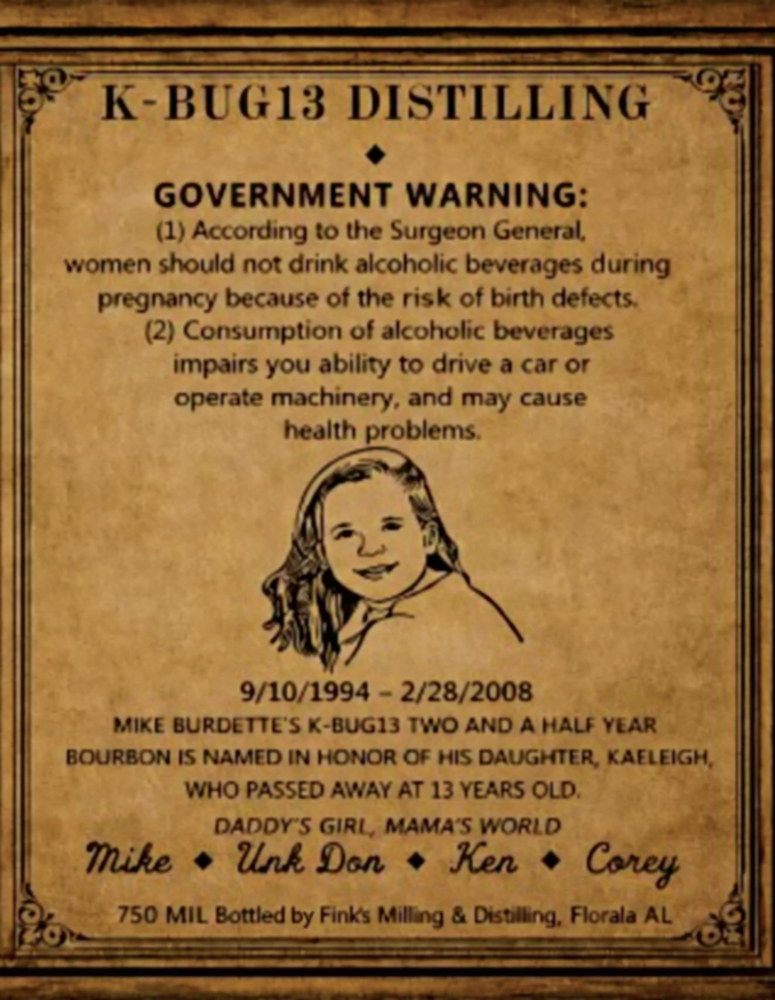
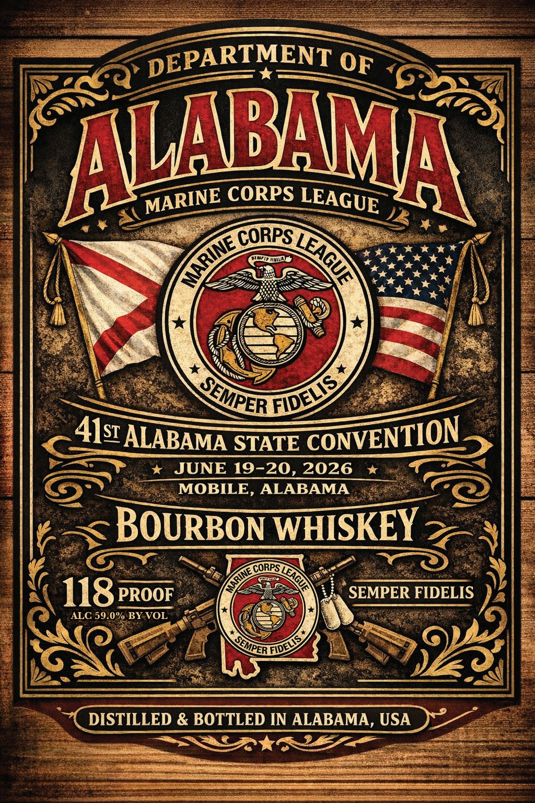

# TTB COLA Label Images - TTBID 26194001000057

**Brand Name:** DEPARTMENT OF ALABAMA MARINE CORPS LEAGUE BOURBON WHISKEY

**Issue Date:** 07/15/2026

**Origin Code:** 10

**Product Class/Type:** 141

**Source:** [TTB Public COLA Registry](https://ttbonline.gov/colasonline/viewColaDetails.do?action=publicFormDisplay&ttbid=26194001000057)

## Label Images

### Back Label

### Label 1

## Extracted Label Text

*Text extracted via OCR - may contain errors*

**Detected Proof:** 118
**Detected Age:** 13 Years

### Back Label

K-BUG13
DISTILLING
GOVERNMENT WARNING:
(1) According to the Surgeon General
women should not drink akoholic beverages during
pregnancy because Of the risk of birth defects:
(2) Consumption of akoholic beverages
impairs you ability to drive a car or
operate machinery; and may cause
health problems
9/10/1994
1
2/28/2008
MIKE BURDETTES K-BUG1S TwO AND A HALF YEAR
BOURBON IS NAMED IN HonOR Of His DAUGHTER, KAELEIGH,
WHO PASSED AWAY AT 13 YEARS OLD.
DADDY S Girl, MAMAS WORLd
Tnike
Unk Don
Ken
750 MIL Bottled by Finks Millang
Disulling; Florala AL
Coney

### Label 1

DEPARTMENT
ALWBA
CORPS
CORPS
41s ALABAMA STATE
JUNE 19-20, 2026
MOBILE , ALABAMA
BOURBON WHISKEY
CORPS_
118pRooF
SEMPER FIDELIS
ALC 59.0% BY VOL
DISTILLED & BOTTLED IN ALABAMA, USA
OF
MARINE
LEAGUE
WEAGUE
MArINE
FIDELIS
SEMPER
CONVENTION
FIDELIS =
SEMPER "
