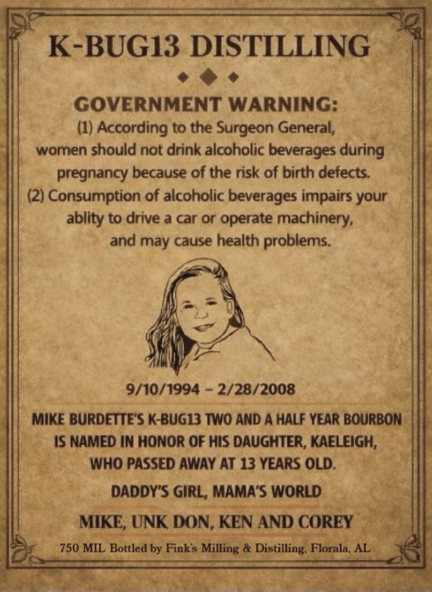
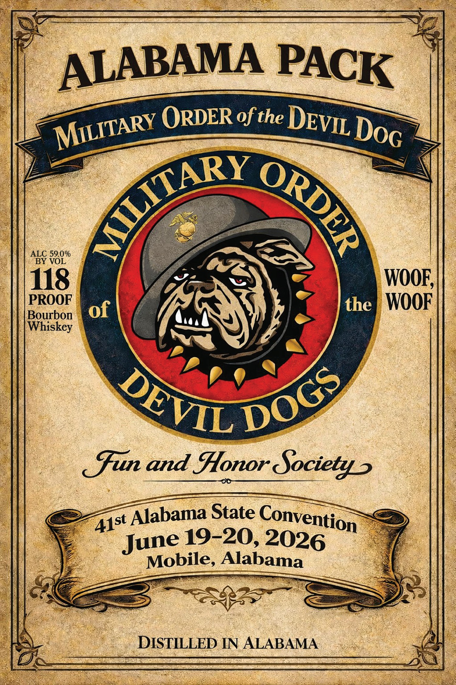

# TTB COLA Label Images - TTBID 26194001000066

**Brand Name:** DEVIL DOG WHISKEY BOURBON WHISKEY

**Issue Date:** 07/18/2026

**Origin Code:** 10

**Product Class/Type:** 141

**Source:** [TTB Public COLA Registry](https://ttbonline.gov/colasonline/viewColaDetails.do?action=publicFormDisplay&ttbid=26194001000066)

## Label Images

### Back Label

### Label 1

## Extracted Label Text

*Text extracted via OCR - may contain errors*

**Detected Age:** 13 Years

### Back Label

K-BUG13 DISTILLING
GOVERNMENT WARNING:
(1) According to the Surgeon General,
women should not drink alcoholic beverages during
pregnancy because of the risk of birth defects:
(2) Consumption of alcoholic beverages impairs
ablity to drive a car or operate
machinery;
and may cause health problems.
9/10/1994
2/28/2008
MIKE BURDETTE'S K-BUG13 TWO AND A HALF YEAR BOURBON
IS NAMED IN HONOR OF HIS DAUGHTER, KAELEIGH;
WHO PASSED AWAY AT 13 YEARS OLD.
DADDYIS GIRL, MAMA'S WORLD
MIKE; UNK DON, KEN AND COREY
750 MIL Bottled by Finks
& Distilling. Florala, AL
your
Milling

### Label 1

ALABAMA
ORDER ofthe
ALC 59.0%
BY VOL
118
WOOF;
PROOF
of
the
WOOF
Bourbon
Whiskey
sfun and Honor Societys
Alabama State
June 19-20;
Mobile, Alabama
DISTILLED IN ALABAMA
PACK
DEVIL
MILITARY
DoG
AILITARY
ORDER
DOGS
DEVIL
Convention
41st
2026
