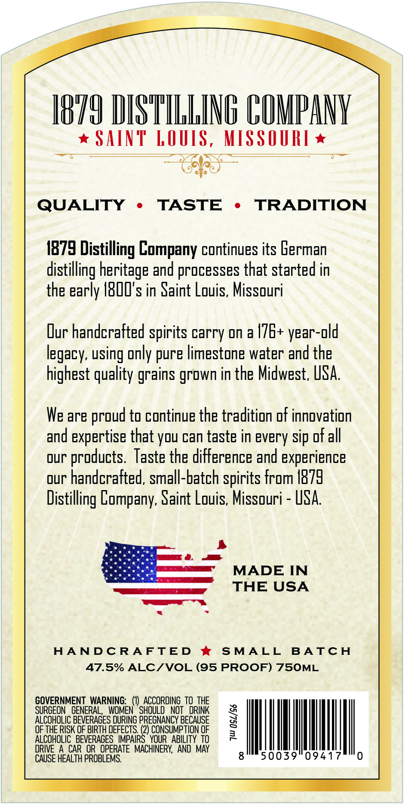
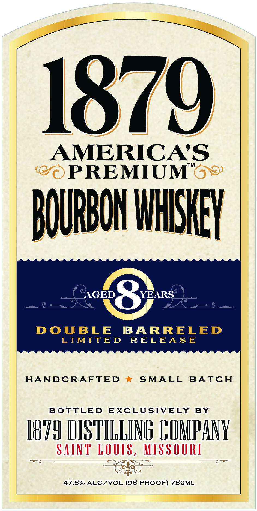
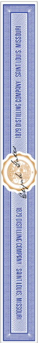

# TTB COLA Label Images - TTBID 26194001000119

**Brand Name:** 1879 PREMIUM

**Fanciful Name:** 8 YEAR BOURBON

**Issue Date:** 07/14/2026

**Origin Code:** 29

**Product Class/Type:** 141

**Source:** [TTB Public COLA Registry](https://ttbonline.gov/colasonline/viewColaDetails.do?action=publicFormDisplay&ttbid=26194001000119)

## Label Images

### Back Label

### Front Label

### Label 3

## Extracted Label Text

*Text extracted via OCR - may contain errors*

*1 image(s) excluded: text did not meet readability threshold*

**Detected Proof:** 95

### Back Label

18I9 DISTILLING COMANK
SAInt LOUIS, MISSOURI
QUALITY
TASTE
TRADITION
1879 Distilling Company continues its Eerman
distilling heritage and processes that started in
the early IBOI' s in Saint Louis, Missouri
Dur handcrafted spirits carry on a /7E+ year-old
using only pure limestone water and the
highest quality
grown in the Midwest; USA.
We are
to continue the tradition of innovation
and expertise that you can taste in every sip of all
our
products; Taste the difference and experience
our handcrafted, small-batch spirits from I879
Distilling Company; Saint Louis; Missouri
uSA
MADE IN
THE USA
HANDC RAFTED
SMALL
BA TC H
47.5% ALCIVOL (95 PROOF) 75OML
GOVERNMENT  WARNING:   (€) ACCORDING TO THE
SURGEON   GENERAL,
WOMEN ^ SHOULD   NOT
DRINK
ALCOHOLIC BEVERAGES DURING PREGNANCY BECAUSE
1
OF THE RISK OF BIRTH DEFECTS. (2) CONSUMPTION OF
ALCOHOLIC   BEVERAGES   IMPAIRS ' YOUR   ABILITY  TO
DRIVE
A CAR  OR  OPERATE  MACHINERY,  AND MAY
CAUSE HEALTH PROBLEMS;
legacy;
grains
proud

### Front Label

1879
AMERICAS
(@
PREMIUM"6?
AOURBON IHHISHEY
AGED
YEARS
DOuBLE
BARRELED
LTMITED
R ELEASE
HANDCRAFTED
SMALL
BATCH
BOTTLED
EXCLUSTVELY BY
J879 HISTILLING CUMPANK
SAiNt" LOUIS , MISSOURI
47.5% ALCIVOL
PROOF) 75OML
