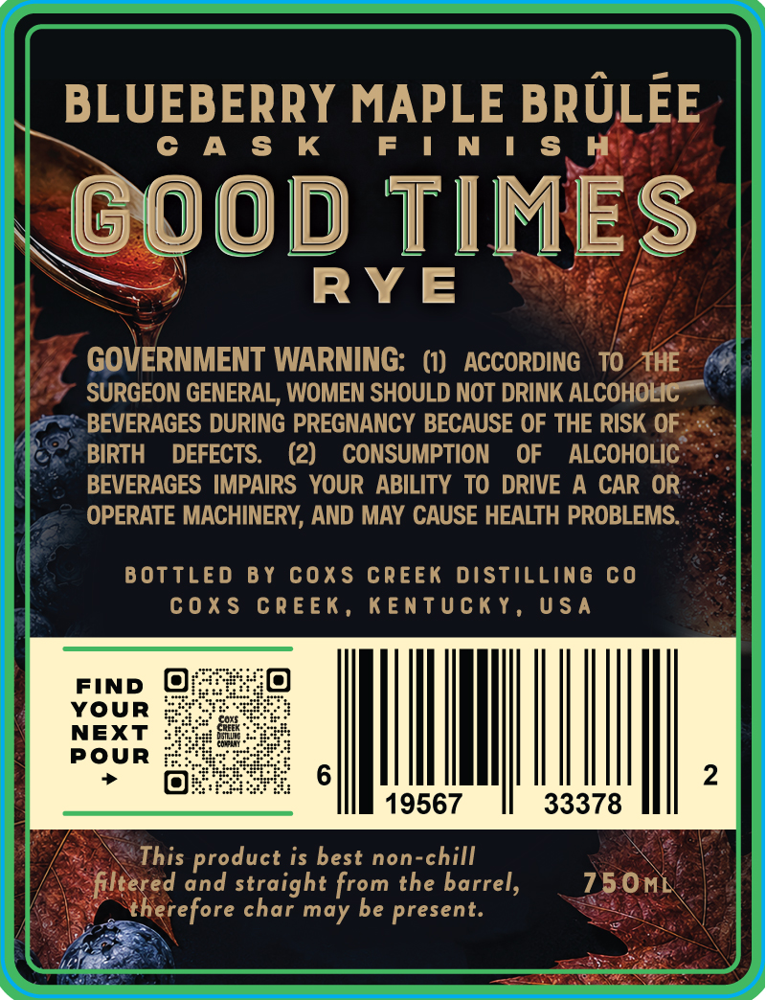
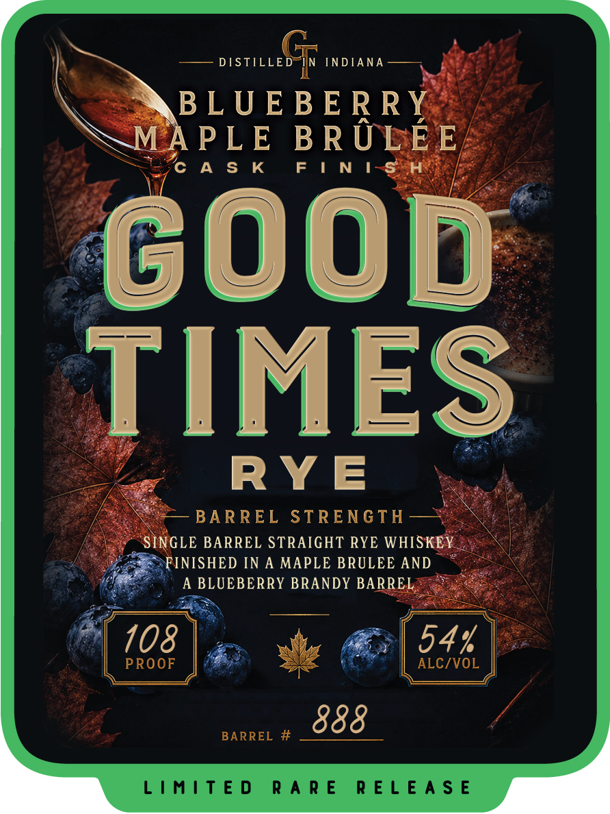

# TTB COLA Label Images - TTBID 26194001000177

**Brand Name:** GOOD TIMES RYE

**Fanciful Name:** BLUEBERRY MAPLE BR'ULE'E CASK FINISH

**Issue Date:** 07/15/2026

**Origin Code:** 22

**Product Class/Type:** 102

**Source:** [TTB Public COLA Registry](https://ttbonline.gov/colasonline/viewColaDetails.do?action=publicFormDisplay&ttbid=26194001000177)

## Label Images

### Back Label

### Front Label

## Extracted Label Text

*Text extracted via OCR - may contain errors*

### Back Label

BLUEBERRY MAPLE BRULEE
0 A $ K
F | N ! $ H
good TIMES
RY E
GOVERNMENT WARNING: (1)
ACCORDING
TO THE
SURGEON GENERAL, WOMEN SHOULD NOT DRINK ALCOHOLIC
BEVERAGES DURING PREGNANCY BECAUSE OF THE RISK OF
BIRTH
DEFECTS:
(2)
CONSUMPTION
OF
ALCOHOLIC
BEVERAGES IMPAIRS  YOUR ABILITY TO DRIVE
A CAR OR
OPERATE MACHINERY, AND MAY CAUSE HEALTH PROBLEMS
B OTTLE D
B Y
coxs creek distilling co
c0Xs crEEk,
KEntuck y_
U $ A
FIND
YoUR
NEXT
PoUR
2
19567
33378
This product is best non-chill
filtered and straight from the barrel,
75OML
therefore char may be present.

### Front Label

i BARREL STRENGTH —*

NGLE BARREL STRAIGHT RYE WHIS

>FINISHED IN A MAPLE BRULEE AND
A BLUEBERRY BRANDY BARR
