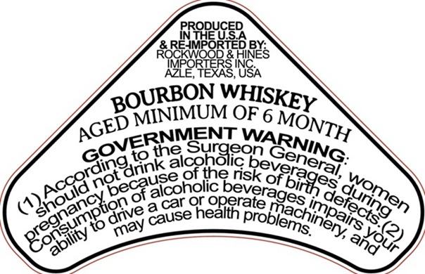
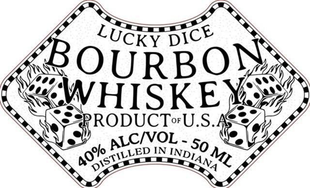

# TTB COLA Label Images - TTBID 26194001000190

**Brand Name:** LUCKY DICE

**Issue Date:** 07/20/2026

**Origin Code:** 00

**Product Class/Type:** 141

**Source:** [TTB Public COLA Registry](https://ttbonline.gov/colasonline/viewColaDetails.do?action=publicFormDisplay&ttbid=26194001000190)

## Label Images

### Back Label

### Front Label

## Extracted Label Text

*Text extracted via OCR - may contain errors*

**Detected Proof:** 80

### Back Label

PRODUCED
A MEE USA
TRE NG,
‘BOURBON Ww
Zp MINIMUM Guskey
NMEN
coving IENT WAR, TH
coat dank alcoholic fn GenING
PS Ka NGeca ne of the risk Verena, ¥
CRORE SSeS Baik oF BRPeS do
seo amNY cause Operate 79S, Dd funpre,
SY STE

### Front Label

B
QURBON
WHISKE
#RODUCToU.S.=
IN
So
LUCKY
DICE
ALCIVOL
40%
DISTILLED
INDIANA
ML
