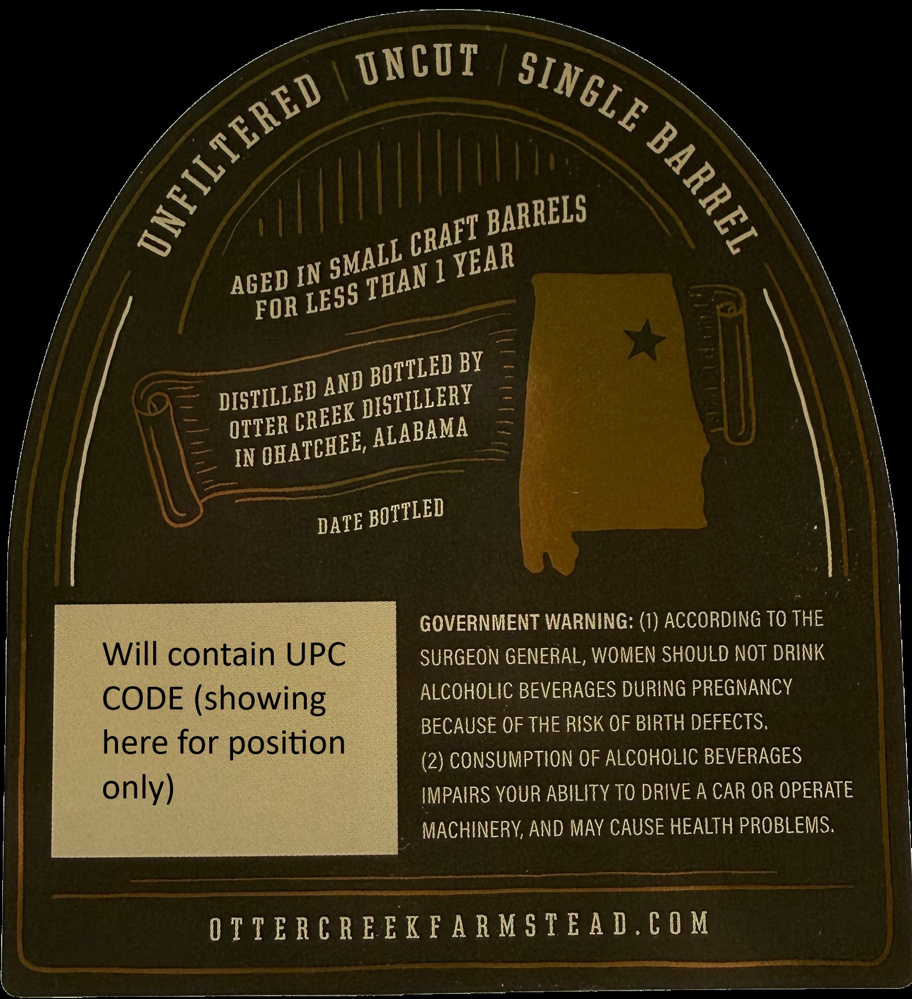
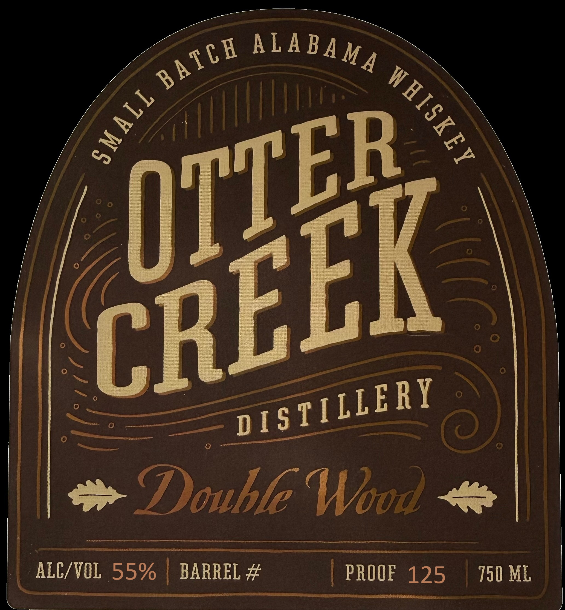

# TTB COLA Label Images - TTBID 26194001000273

**Brand Name:** OTTER CREEK DISTILLERY

**Fanciful Name:** SMALL BATCH ALABAMA WHISKEY, DOUBLE WOOD

**Issue Date:** 07/15/2026

**Origin Code:** 10

**Product Class/Type:** 140

**Source:** [TTB Public COLA Registry](https://ttbonline.gov/colasonline/viewColaDetails.do?action=publicFormDisplay&ttbid=26194001000273)

## Label Images

### Back Label

### Front Label

### Label 2

## Extracted Label Text

*Text extracted via OCR - may contain errors*

**Detected Proof:** 125

### Back Label

UNCOT
IN
1
FOR
BY
OTTER
IN
GOVERNMENT WARNING: (1) ACCORDING To THE
Will contain UPC
SURGEON GENERAL, WOMEN SHOULD NOT DRINK
CODE (showing
ALCOHOLIC BEVERAGES DURING PREGNANCY
BECAUSE OF THE RISK OF BIRTH DEFECTS.
here for position
(2) CONSUMPTION OF ALCOHOLIC BEVERAGES
only)
IMPAIRS VOUR ABILITY TO DRIVE A CAR OR OPERATE
MACHINERV; AND MAY CAUSE HEALTH PROBLEMS:
0 T € E R € R E EKF A R M $ € E A D,€ 0 M
SINGLE
TERED
1
1
BARRELS
CRAFT
SMALL
YEAR
THAN
AGED
LESS
BOTTLED
AND
DISTILLED
DISTILLERY
CREEK
ALABAMA
OHATCHEE,
BOTTLED
DATE

### Front Label

TE

(

a Double Woo

‘2

ALY TOL 5 55% 9% | BARREL BARREL #

| PROOF PROOF 125 750 ML

### Label 2

PROUDLY DISTILLED
DOWN SIX FOOT ROAD
