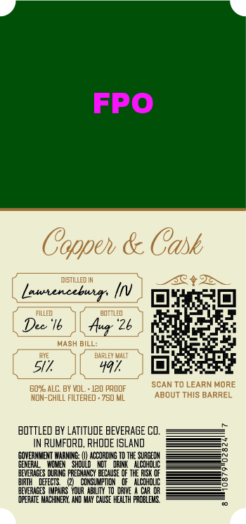
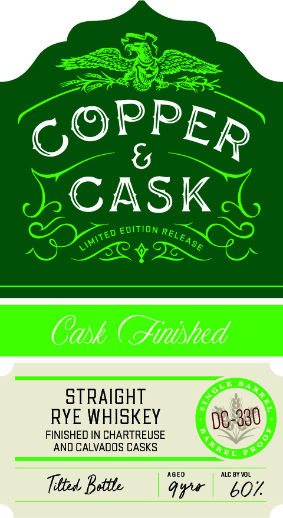

# TTB COLA Label Images - TTBID 26194001000348

**Brand Name:** COPPER & CASK

**Issue Date:** 07/15/2026

**Origin Code:** 40

**Product Class/Type:** 102

**Source:** [TTB Public COLA Registry](https://ttbonline.gov/colasonline/viewColaDetails.do?action=publicFormDisplay&ttbid=26194001000348)

## Label Images

### Back Label

### Front Label

### Label 3

## Extracted Label Text

*Text extracted via OCR - may contain errors*

**Detected Proof:** 120

### Back Label

FPO
Coppeh & Cask
distilled IN
3012
Lautencebur: Inv
FILLED
BOttled
Dec '16
Aua "26
MaSH BILL:
BARLEY MalT
51
4a7
E0ro ALC BY VOL
120 pROOF
SCANTO LEARN MORE
MON-CHILL
FILTERED
750 ML
ABOUT ThIS BARREL
BOTTLED BY LaTITude BEVERAGE CO.
RumFORO, RHODE ISLAND
GONERMMEMT WARMINE:;
NCCORDIG T0`
SURGEIM
HOMEH
ShDULD
DRINK
AlCOHOLIC
BEVERAGES DURING PREEMANCV BECAUSE QF THE RISk OF
BIRTH
DEFECIS
CONSUMPTICM
0f   AcOHOLIC
beVERAGES  MFhRS  YourAE UTN' T0 daIVE
Car @r
OPERATE MNCHINERY , AND MY CAUSE health FcbLeHS

### Front Label

SCASK
EDITION
Cask ( inished
BA
stRAIGHT
RYE WHISKEY
DC-330
FINISHED IN CHARTREUSE
AND CALVADOS CASKS
AGED
ALC BY VOL
Tittel Battb
Aur
b07
PPER
Go
RELE
LIMITED
LEASE

### Label 3

Ras NN
aoa SEN \ kz
COPPER & CASK ySva B Hadd09 “>
AM
