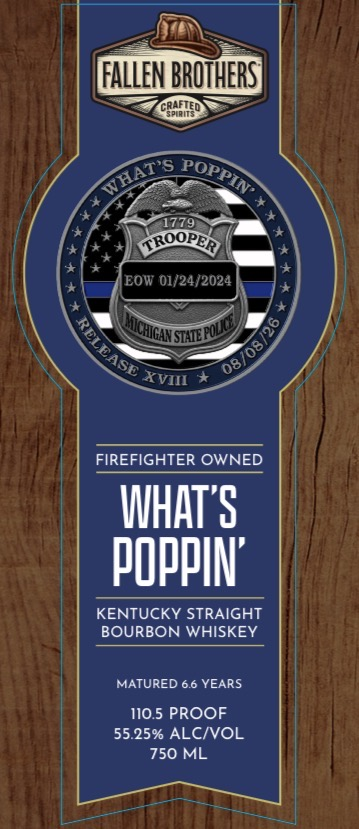
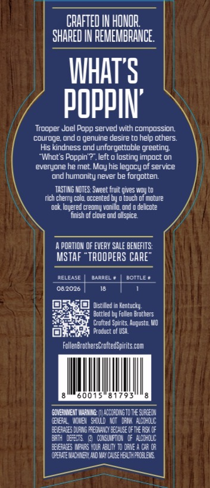
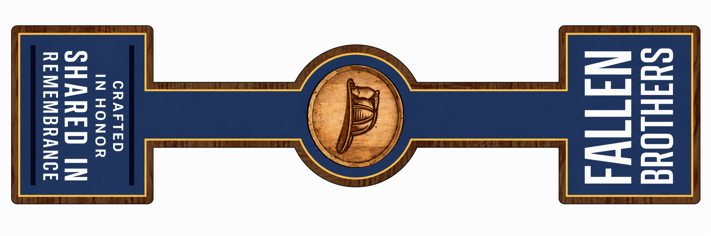

# TTB COLA Label Images - TTBID 26194001000382

**Brand Name:** FALLEN BROTHERS CRAFTED SPIRITS

**Fanciful Name:** WHATS POPPIN
KENTUCKY STRAIGHT BOURBON WHISKEY

**Issue Date:** 07/15/2026

**Origin Code:** 29

**Product Class/Type:** 101

**Source:** [TTB Public COLA Registry](https://ttbonline.gov/colasonline/viewColaDetails.do?action=publicFormDisplay&ttbid=26194001000382)

## Label Images

### Label 1

### Label 2

### Label 3

## Extracted Label Text

*Text extracted via OCR - may contain errors*

**Detected Proof:** 110.5
**Detected Age:** 6.6 Years

### Label 1

FALLEN BROHHERS]
CRAFLEQ
1779
CROOPER
EOW 01/24/2024
FIREFIGHTER OWNED
IHATYS
pOPPIN'
KENTUCKY STRAIGHT
BOURBON WHISKEY
MATURED 6.6 YEARS
110.5 PROOF
55.25% ALCIVOL
750 ML
WHAT $
POPPIN"
RELEASE
08708/26
VSTATEBLLI
Ichcans
XVIII

### Label 2

CRAFTED IN HONOR
SHARED IN FEMEMBRANCE
IHATS
pOPPIN'
Trooper Joel Popp served with compossion
couroge ond@ genuine desire to help others.
His kindness und unforgettoble greeting
"Whot $ Poppin ?" left c
losting impoct on
everyone he met_ Moy his legocy of service
ond humonity never be forgotten
TASTIHG KoTes: Sweet Fruie gnes WDl (o
rich cherry colo occented by
touch of motute
ook Inyered crenmy vonillo ond
delicote
fnish of Clove und ouspice
PORTION Of Eevepy SALe beMEFITS:
MSTAF "trOOpERS Care"
RELEASE
BAAREL
BOTTLE *
08.2026
Distilled in Kentucky;
Bottled by Fellen Arothers
Cruited Spirits; Auqusto WO
Product of U54
FollenErgehersCroitedspiries com
0015
8 1793
GOVERRMEH HeMIa
ACCOFCIRG TO Te sufcEoh
WEF4 , Mhbe
shlld MoT  Dadkl  plodhclc:
NerhceS Ilalg peuhicy eecilse Oft fx< OF
E
DEECTE
Wdislaftijk  IF alodhclk
@ehcEs MAIRS YOlA HOLTX @ dahe ^ Gr (A
OPETHEM CHMEX HOva calse HevlheflelEKE

### Label 3

SUIHLOWG
NIT

CRAFTED
IN HONOR

SHARED IN

REMEMBRANCE
