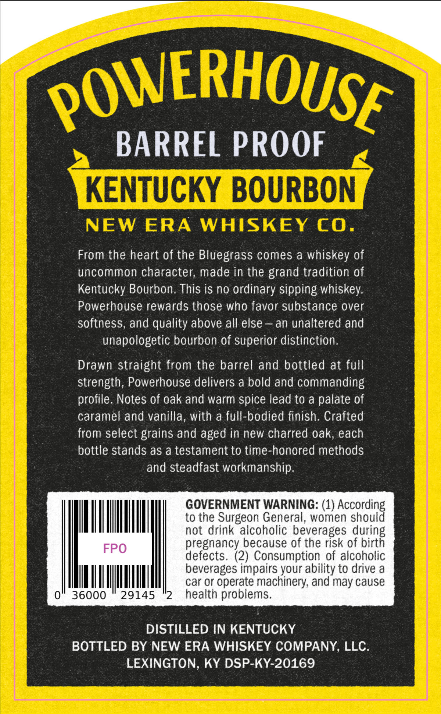
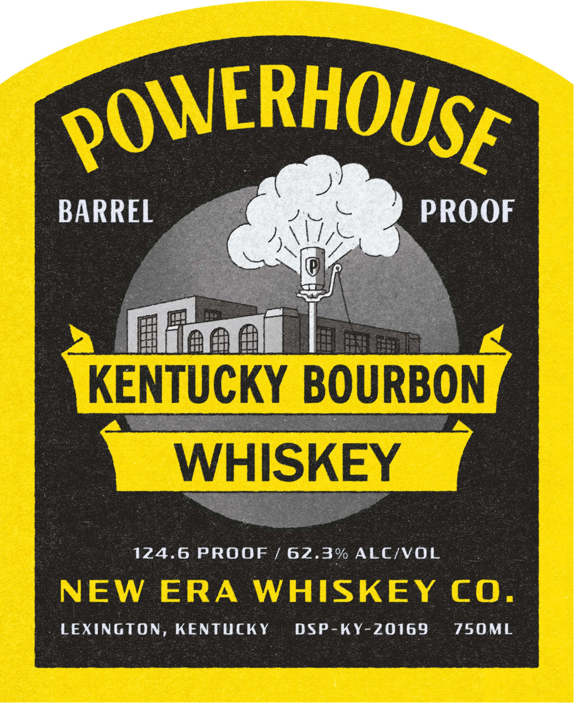

# TTB COLA Label Images - TTBID 26194001000575

**Brand Name:** POWERHOUSE

**Issue Date:** 07/16/2026

**Origin Code:** 22

**Product Class/Type:** 141

**Source:** [TTB Public COLA Registry](https://ttbonline.gov/colasonline/viewColaDetails.do?action=publicFormDisplay&ttbid=26194001000575)

## Label Images

### Back Label

### Front Label

## Extracted Label Text

*Text extracted via OCR - may contain errors*

**Detected Proof:** 124.6

### Back Label

POWERHOUSE
BARREL PROOF
KENTUCKY BOURBON
NEW
ERA
WHISKEY
cO.
From the heart of the Bluegrass comes a whiskey of
uncommon character; made in the grand tradition of
Kentucky Bourbon. This is no ordinary sipping whiskey:
Powerhouse rewards those who favor substance over
softness, and quality above all else
an unaltered and
unapologetic bourbon of superior distinction.
Drawn straight from the barrel and bottled at full
strength, Powerhouse delivers a bold and commanding
profile. Notes of oak and warm spice lead to a palate of
caramel and vanilla, With a full-bodied finish. Crafted
from select grains and aged in new charred oak, each
bottle stands as a testament to time-honored methods
and steadfast workmanship:
GOVERNMENT WARNING: (1) According
to the Surgeon General, women should
not drink alcoholic beverages during
FPO
pregnancy because of the risk of birth
defects. (2) Consumption of alcoholic
beverages impairs your ability to drive a
car Or operate machinery; and may cause
0
36000
29145
2
health problems.
DISTILLED IN KENTUCKY
BOTTLED BY NEW ERA WHISKEY COMPANY, LLC
LEXINGTON
KY DSP-KY-20169

### Front Label

caer
ee Pe :
Re ob :
; Ht Bee RE. eo: ey |
+ aeaa tn M3 4
R R Bete Septet | / ( :
Se Ae oe hick hee @ :
eta See ee J /
= s - ae ? h ee aer
| 2 1 eae Tic? I~. | ia er ns Sega = ae ‘
pr ire ae \ ‘ Rech en a eeme
4 a eee ee ey ra a aki fe i ae ee : YX
oP Se ae a ‘ FF aE Sees ee al Sg eae ans
Sag MoE a ee. Ot he pebeaeee tea ae ahi: Bee: ees reget Spe inti? ie
| ee Bes es ae ey, ahceeesigh sea) mo ee
AO eh aa a SS Bess em pe abe er ee: sa tag Se i ges
Puree Age Casa Ra ene Spt,
SEER teeta Reals Gee pages: Sein Oy Re: Bee a eo ence ee ae
| ee —— ey x ees ee OB eto eh 3 Ge Aare te Ai AA a ae :
er es é m Re Seren ER A RT Be see oe
; ‘Be pistonie : ¥ votes " EGA — com ne sata we
pies jas lems aes be ~ 3 we uete Se ‘hema
io “alba sas oat oes Mine Ne ins Sova:
‘| gst an H it i He
want Hic fcc
ao ca oh
Bi PH
7 7 |
cA
Patton bimaniose satis PAA eth, tie is Sr aeae 5
5 ee REE SS Ne ee eae ACA Ss
ss me PERG ES oo Boe t Se eee nae en Pe eet
"AR alae aie iene Sere oe Fig ca acre eg Saas
ae oe a yung ev eee tear 2 eu ines ia aie oe
é ane ibe ae abs Sys! a Ty ,
i 2 Serer ee
Page poe ea ee Sy, evinies? :
ppp ase: SE HE ae WATE ARES ron eee is ‘
oe a Sap Reg Rg a Bit tae Bene eaeee
a - oa es oy IE. eee: Recs Ba ie BS ax :
| —_ howe ms eta ca a 2 Bis SOONER aa . 2
\ : k sacs of Eee ees Rs RE
R 3 Ose sa SR ae 3
PROOF / 62.3% ALC/ |
124.6 )
KY DSP-KY-20169 ON
LEXINGTON, KEN |
