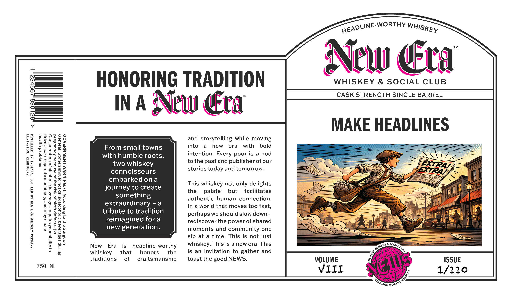
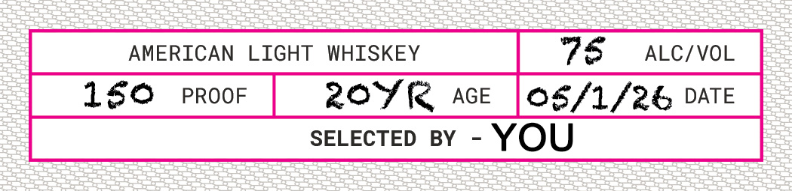

# TTB COLA Label Images - TTBID 26194001000608

**Brand Name:** NEW ERA WHISKEY & SOCIAL CLUB

**Issue Date:** 07/16/2026

**Origin Code:** 22

**Product Class/Type:** 144

**Source:** [TTB Public COLA Registry](https://ttbonline.gov/colasonline/viewColaDetails.do?action=publicFormDisplay&ttbid=26194001000608)

## Label Images

### Label 1

### Label 2

## Extracted Label Text

*Text extracted via OCR - may contain errors*

**Detected Proof:** 160

### Label 1

“AMONLNMAM ‘NOLONIX37
< 182

“ANVdWOD ASMSIHM VS MIN AG G3ILLOG “WNVIGNI NI G3TTILSIG

“swiajqoid yzyeay

asnes Aew pue ‘Asaulydew ajesado Jo ed e BALIp

0} Aqyiqe anoX saleduil sadesaAeq d1]0Yyoo]e Jo UoNWduINsuOD
(Z)"S}9a,ap YLAIG Jo YSI1 ay} Jo asneseq Aoueuseid

SULINp sadesareq 91]0Yoo]e YULIP }OU PjNoYs USWOM ‘|e1aUey

758 ML

uoasing ay} 0} Bulpsod9y (L) :DNINNVM LNAINNYFA0D

INA:

©

HONORING TRADITION
New ra

From small towns
with humble roots,
two whiskey
connoisseurs
embarked ona

journey to create
something
extraordinary - a
tribute to tradition
reimagined fora
new generation.

New Era is_ headline-worthy
whiskey that honors’ the
traditions of craftsmanship

and storytelling while moving
into a new era with bold
intention. Every pour is a nod
to the past and publisher of our
stories today and tomorrow.

This whiskey not only delights
the palate but facilitates
authentic human connection.
In a world that moves too fast,
perhaps we should slow down -
rediscover the power of shared
moments and community one
sip at a time. This is not just
whiskey. This is a new era. This
is an invitation to gather and
toast the good NEWS.

New ¢ ra

WHISKEY & SOCIAL CLUB
CASK STRENGTH SINGLE BARREL

MAKE HEADLINES

VOLUME
VIII

### Label 2

AMERICAN
LIGHT
WHISKEY
76
ALC/VOL
160
PROOF
20yk
AGE
05/1/26 DATE
SELECTED
BY
YOU
