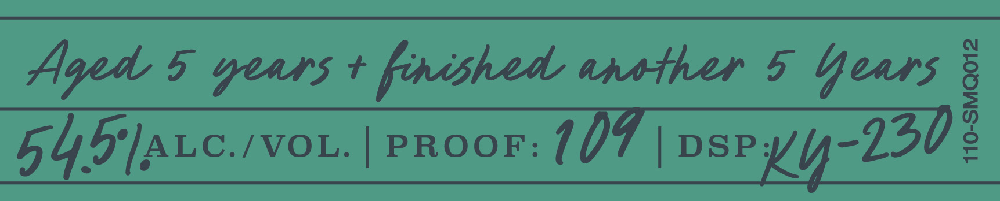
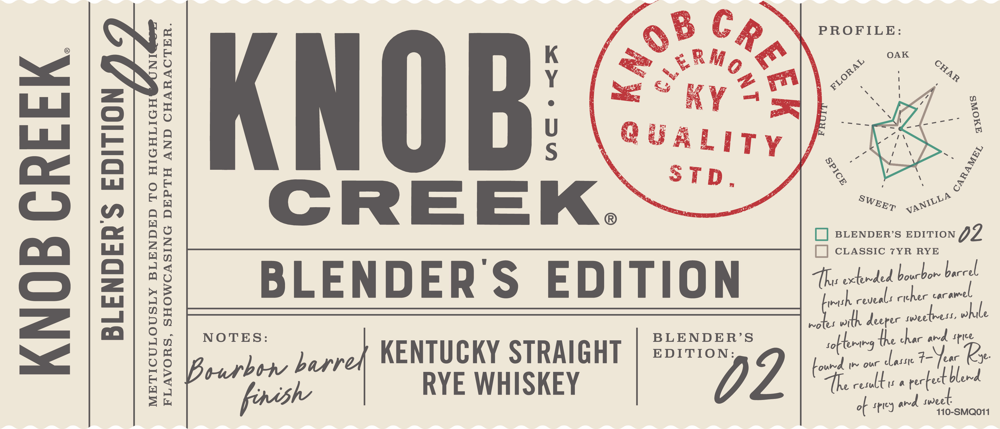
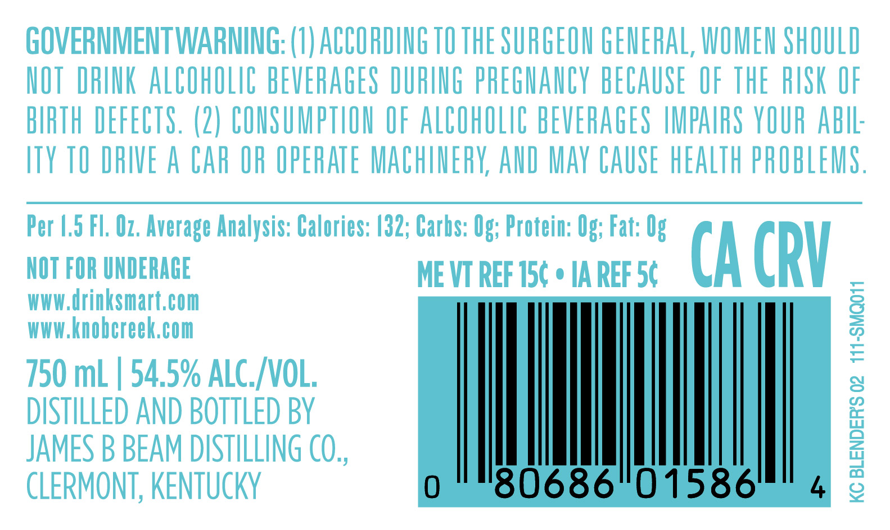

# TTB COLA Label Images - TTBID 26194001000619

**Brand Name:** KNOB CREEK

**Issue Date:** 08/04/2026

**Origin Code:** 22

**Product Class/Type:** 102

**Source:** [TTB Public COLA Registry](https://ttbonline.gov/colasonline/viewColaDetails.do?action=publicFormDisplay&ttbid=26194001000619)

## Label Images

### Label 1

### Label 2

### Label 3

### Label 4

## Extracted Label Text

*Text extracted via OCR - may contain errors*

*1 image(s) excluded: text did not meet readability threshold*

**Detected Proof:** 109
**Detected Age:** 7 Years

### Label 1

Aged © years + faishad ansibar § Yours §
54 5'/ALc./voL. PROOF: 10 | eos =o

110-SMQ012

### Label 2

‘| PROFILE:

noe <

S >
WEED yyw

im BLENDER’S EDITION 02

x
[-] CLASSIC 7YR RYE
BLENDERS ED i TION | thertntsthecte ber
Ins Weerueal rit cher coronal

ie with deeper moeethess. Einle

ae and Spice

KENTUCKY STRAIGHT | 5°28 > | trol 7B,
peer e RYE WHISKEY D | pcti et

C Poy | sweel-
of f J 110-SMQ011

BLENDERS EDITION

NOTES: BLENDER’S

KNOB CREEK

FLAVORS, SHOWCASING DEPTH AND CHARACTER.

METICULOUSLY BLENDED TO HIGHLIGH

### Label 3

GOVERNMENTWARNING: (U) ACCOHDING TO THE SURGEOU GENERAL; WOMEN ShOULD
HOT  DRINK ALCOhOLIC BEVERAGES DURIUG pREGHaNCY BECAUSE  OF THE RISK OF
BIRTH DEFECTS. (2) COUSUMPTHON OF ALCOhOLIC BEVERAGES IMPAIRS YOUR AbIL:
ITY TO DRIVE A CAr OR OPERATE MAChINERK; AND Mav CAUSE hEALTh PROBLEMS ,
Per |,5 FL, Oz. Average Analysis: Calories: /32; Carbs: Og; Protein: Og; Fat: Og
NOT FOR UNDERAGE
ME VT REF 15c
IA REF 56
CA CRV
wwW drinksmart,com
WWW knobcreek,com
1
750 mL
54.5% ALC_VOL;
8
DISTILLED AND BOTTLED BY
JAMES B BEAM DISTILLING CO,,
1
CLERMONT, KENTUCKY
80686"01586'
