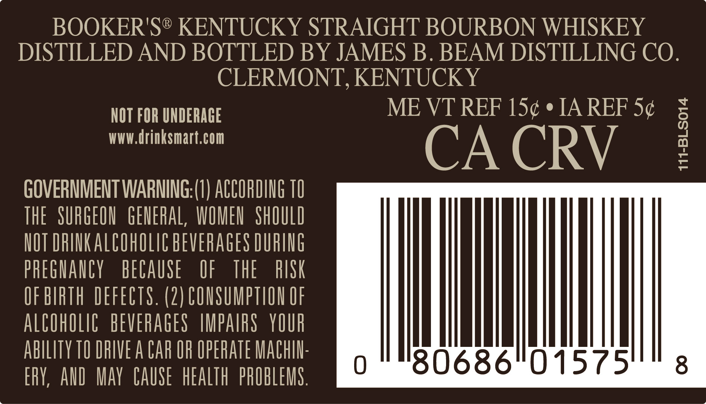
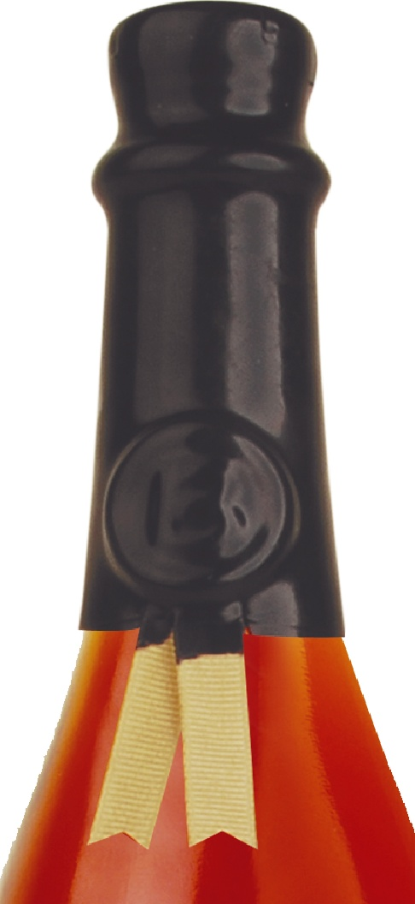

# TTB COLA Label Images - TTBID 26194001000657

**Brand Name:** BOOKER'S

**Issue Date:** 07/16/2026

**Origin Code:** 22

**Product Class/Type:** 101

**Source:** [TTB Public COLA Registry](https://ttbonline.gov/colasonline/viewColaDetails.do?action=publicFormDisplay&ttbid=26194001000657)

## Label Images

### Back Label

### Label 4

## Extracted Label Text

*Text extracted via OCR - may contain errors*

*1 image(s) excluded: text did not meet readability threshold*

### Back Label

BOOKER'S® KENTUCKY STRAIGHT BOURBON WHISKEY

DISTILLED AND BOTTLED BY JAMES B. BEAM DISTILLING CO.

CLERMONT, KENTUCKY

NOT FOR UNDERAGE

ME VT REF 15¢ ¢ IA REF 5¢

www.drinksmart.com

CA CRV

GOVERNMENT WARNING:(1) ACCORDING 10

THE SURGEON GENERAL, WOMEN SHOULD

NOT DRINK ALCOWOLIC BEVERAGES DURING

PREGNANCY BECAUSE

OF THE

RISK

OF BIRTH DEFECTS. (2) CONSUMPTION OF

ALCOHOLIC BEVERAGES IMPAIRS YOUR

ABILITY TO DRIVE A CAR OF OPERATE MACHIN

‘MT

ERY, AND MAY CAUSE HEALTH PROBLEMS
