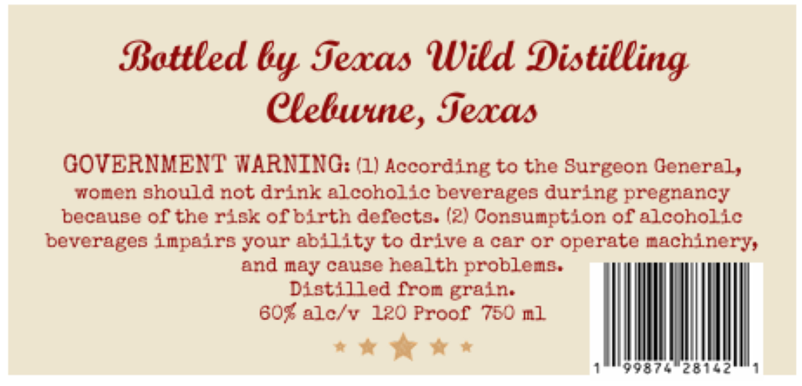
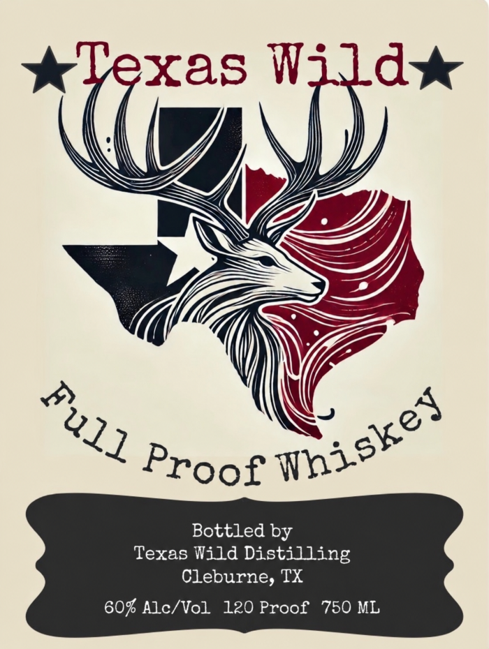

# TTB COLA Label Images - TTBID 26194001000675

**Brand Name:** TEXAS WILD FULL PROOF WHISKEY

**Issue Date:** 07/15/2026

**Origin Code:** 44

**Product Class/Type:** 140

**Source:** [TTB Public COLA Registry](https://ttbonline.gov/colasonline/viewColaDetails.do?action=publicFormDisplay&ttbid=26194001000675)

## Label Images

### Back Label

### Front Label

## Extracted Label Text

*Text extracted via OCR - may contain errors*

**Detected Proof:** 120

### Back Label

Battled 6y Sexas Wild Distilling
Clebuue, Jeacas
GOVERNMENT MARNING: (1) According to the Surgecon Oeneral,
wonen should not drink alcoholic beverages during pregnancy
because of the risk ofbirth defects: (2} Consumption of alcoholic
beverages impaire your ability to drive 4 car or operate nachinery,
and may cause health problens.
Distilled fron grain:
804 alc/v 120 Proof 750 ml
99870"28102

### Front Label

Texas Wild
Bottled by
Texas Wild
Distilling
Cleburne, TX
60% Alc/Vol
120 Proof
750 ML
Full
Whiskes
Proof
