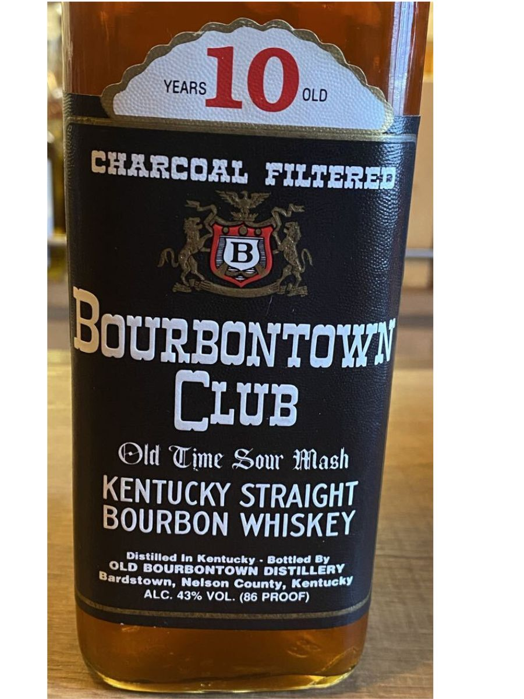
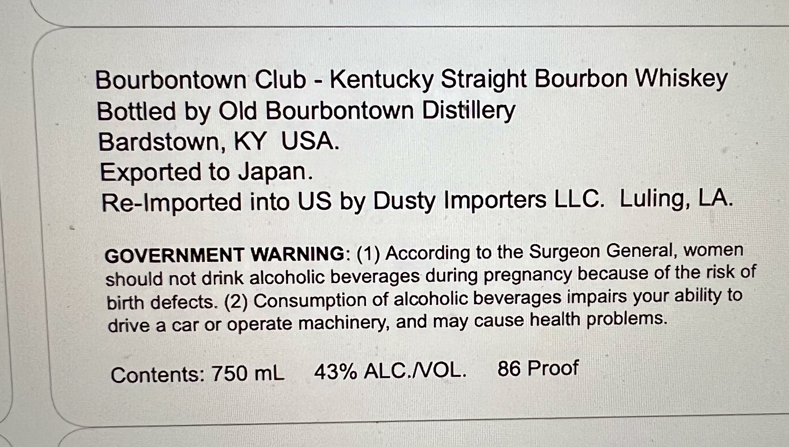

# TTB COLA Label Images - TTBID 26194001000739

**Brand Name:** BOURBONTOWN CLUB

**Issue Date:** 07/15/2026

**Origin Code:** 22

**Product Class/Type:** 101

**Source:** [TTB Public COLA Registry](https://ttbonline.gov/colasonline/viewColaDetails.do?action=publicFormDisplay&ttbid=26194001000739)

## Label Images

### Label 1

### Label 2

## Extracted Label Text

*Text extracted via OCR - may contain errors*

**Detected Proof:** 86

### Label 1

YEARS
10
OLD
cxarcoxL filterEd
B
Bourbontowi
CLuB
Old Wime Sour" Ilash
KENTUCKY STRAIGHT
BOURBON WHISKEY
Distilled In Kontucky
Bottlod By
OLD bourbontoin distillcay
Nolson County, Kentucky
ALC. 43% VOL. (86 Proof)
Bardstown;

### Label 2

Bourbontown Club
Kentucky Straight Bourbon Whiskey
Bottled by Old Bourbontown Distillery
Bardstown, KY
USA.
Exported t0 Japan.
Re-Imported into US
Dusty Importers LLC.
Luling, LA.
GOVERNMENT WARNING: (1) According to the Surgeon General, women
should not drink alcoholic beverages during pregnancy because of the risk of
birth defects: (2) Consumption of alcoholic beverages impairs your ability to
drive a car or
operate machinery, and may cause health problems:
Contents: 750 mL
43% ALC.NOL:
86 Proof
by
