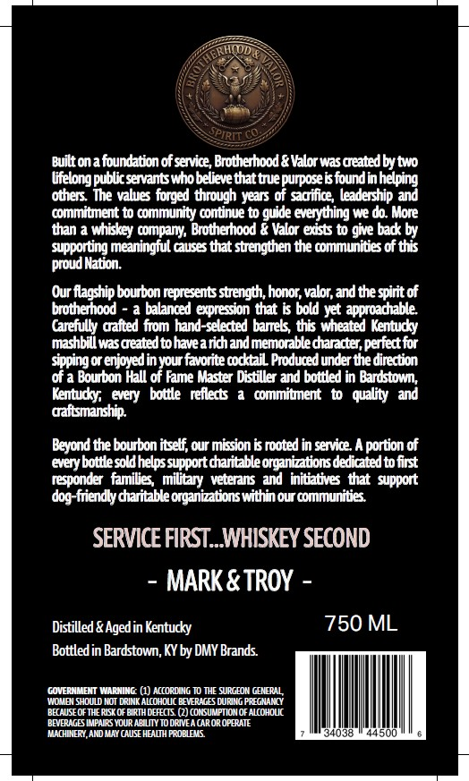
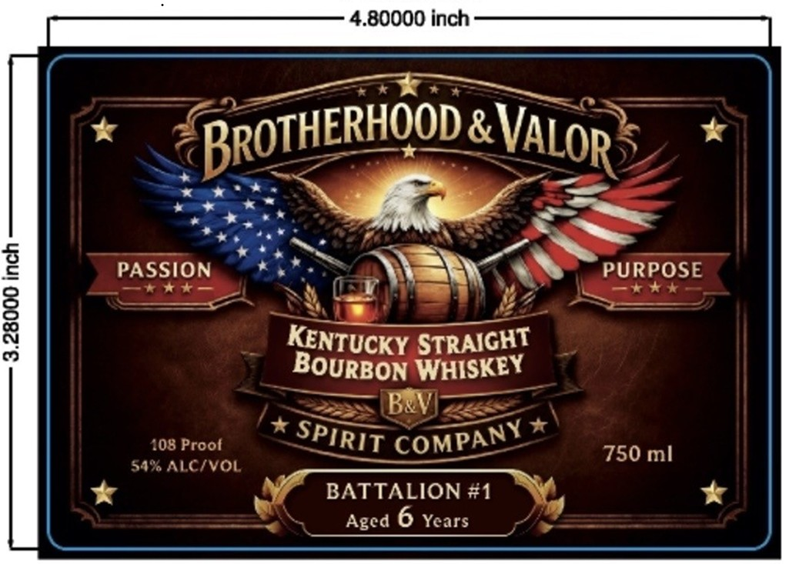

# TTB COLA Label Images - TTBID 26194001000741

**Brand Name:** BROTHERHOOD & VALOR

**Issue Date:** 07/15/2026

**Origin Code:** 22

**Product Class/Type:** 101

**Source:** [TTB Public COLA Registry](https://ttbonline.gov/colasonline/viewColaDetails.do?action=publicFormDisplay&ttbid=26194001000741)

## Label Images

### Back Label

### Label 1

## Extracted Label Text

*Text extracted via OCR - may contain errors*

**Detected Age:** 6 Years

### Back Label

Builtonafoundation ofservice Brotherhood & Valor was Oeatedbytwo
Uifelongpublc serants whobelieve that bue purpose i foundinhelping
others  The values furged through years of soiflce; leadership and
commiunent t0 community continue t0 guide everything we do More
than a whiskcy cmpany; Brotherhood & Valor exsts t0 give bad by
supporting meaningful Guses that suengthen the communities of tss
INation
Our flagship bourbon represents sbength honor, valr; and the xlritof
brottherhood
a balanced expreson that & bold yet approadable
Carefully oalted fiom hand-selerted banek thb Weated Kentudky
mashbi wasdeatedtohaveandandmemorabledaradter perfert for
sppingcr enjoyed inyour favorite odtal Poduoed under the direction
of a Bourbon Hall of Fame Master Ditiller and bottled in Bardstow;
Kentudy;   every)bottle  reflerts
commibnent t quality  and
oaftsmanship
Beyond the bourbon itsetf; cur mision & rooted in service Aportion of
cvery bottlesoldhelps
daritableorgantatiols dedicated to fint
responder families
Ilpotc
veterans ad initiatives tat support
dog-friendty dharitable organizationswithin ou communitiss
SERVICE FIRST__WHISKEY SECOND
MARK & TROY
Distilled & Agedin Kentucky
750 ML
Bottled in Bardstown, KY by DMY Brands
GOVERNMENT WARNING (1) AccoRDING T0 THE SURLEON (ERAL
WOMBI shoULD NOT DRINK ALcohOUC BEVERNES DURING PREGNANY
BAUSE OF THE RISK OF BIRTH DEFECTS (2) CONSUMPTION OF ALcohOUC
BEVERAGES IMPAIRS YOUR APTLITY TO DRIVEA CAR OR OPERATE
MACHINERY,AMD MAY (AuSE HEAWH PROBLBL
038
500
proud[

### Label 1

4.80000 inch
&
8
PASSION
PURPOSE
1
STRAIGHT
BOURBON WHISKEY
BaVI
708 Proot
750 ml
54%Aicivol
BATTALION #1
Aged 6 Years
BRoTHERHOOD.
VALOR
KENTUCKY
SPIRIT
COMPANY
