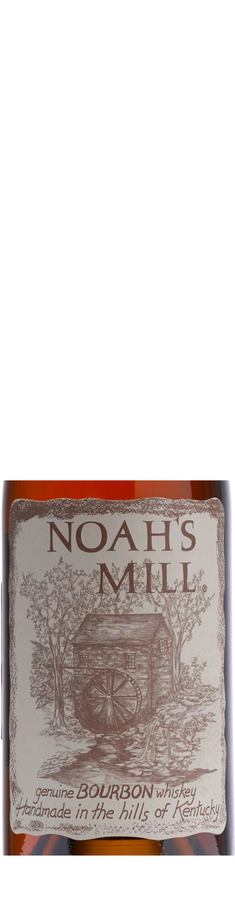
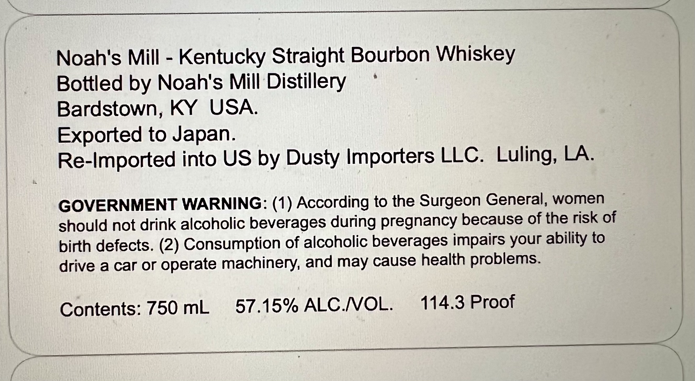

# TTB COLA Label Images - TTBID 26194001000746

**Brand Name:** NOAH'S MILL

**Issue Date:** 07/16/2026

**Origin Code:** 23

**Product Class/Type:** 141

**Source:** [TTB Public COLA Registry](https://ttbonline.gov/colasonline/viewColaDetails.do?action=publicFormDisplay&ttbid=26194001000746)

## Label Images

### Label 1

### Label 2

## Extracted Label Text

*Text extracted via OCR - may contain errors*

**Detected Proof:** 114.3

### Label 1

NOAHS
MILL;
genuine BOURBONwhiskey
Handmade in the hills of Kenfucky

### Label 2

Noah's Mill
5
Kentucky Straight Bourbon Whiskey
Bottled
Noah's Mill Distillery
Bardstown, KY
USA
Exported to Japan:
Re-Imported into US by Dusty Importers LLC. Luling; LA
GOVERNMENT WARNING: (1) According to the Surgeon General, women
should not drink alcoholic beverages during pregnancy because of the risk of
birth defects: (2) Consumption of alcoholic beverages impairs your ability to
drive a car or
operate machinery, and may cause health problems:
Contents: 750 mL
57.15% ALCNOL.
114.3 Proof
by
