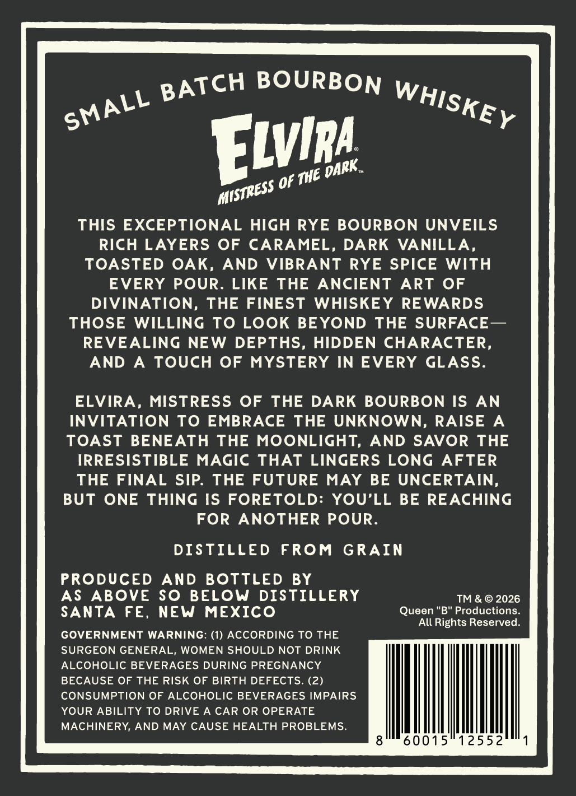
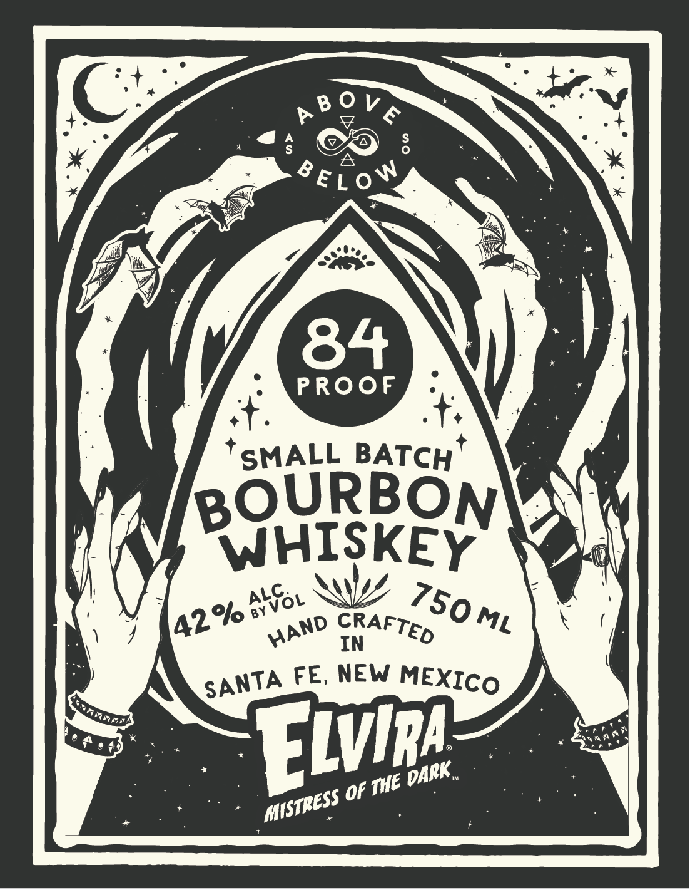

# TTB COLA Label Images - TTBID 26194001000763

**Brand Name:** ELVIRA BOURBON WHISKEY

**Issue Date:** 07/20/2026

**Origin Code:** 34

**Product Class/Type:** 141

**Source:** [TTB Public COLA Registry](https://ttbonline.gov/colasonline/viewColaDetails.do?action=publicFormDisplay&ttbid=26194001000763)

## Label Images

### Back Label

### Front Label

### Label 2

## Extracted Label Text

*Text extracted via OCR - may contain errors*

*1 image(s) excluded: text did not meet readability threshold*

**Detected Proof:** 84

### Back Label

S

L -s “a Wiis

vine

mistPess LV

THIS EXCEPTIONAL HIGH RYE BOURBON UNVEILS

RICH LAYERS OF CARAMEL, DARK VANILLA

TOASTED OAK, AND VIBRANT RYE SPICE WITH

EVERY POUR. LIKE THE ANCIENT ART OF

DIVINATION, THE FINEST WHISKEY REWARDS

THOSE WILLING TO LOOK BEYOND THE SURFACE—

REVEALING NEW DEPTHS, HIDDEN CHARACTER

AND A TOUCH OF MYSTERY IN EVERY GLASS

ELVIRA, MISTRESS OF THE DARK BOURBON IS AN

INVITATION TO EMBRACE THE UNKNOWN, RAISE A

TOAST BENEATH THE MOONLIGHT, AND SAVOR THE

IRRESISTIBLE MAGIC THAT LINGERS LONG AFTER

THE FINAL SIP. THE FUTURE MAY BE UNCERTAIN

BUT ONE THING IS FORETOLD: YOU’LL BE REACHING

FOR ANOTHER POUR

DISTILLED FROM GRAIN

PRODUCED AND BOTTLED BY

AS ABOVE SO BELOW DISTILLERY

T™ & © 2026

SANTA FE, NEW MEXICO

Queen "B" Productions.

All Rights Reserved.

GOVERNMENT WARNING: (1) ACCORDING TO THE

SURGEON GENERAL, WOMEN SHOULD NOT DRINK

ALCOHOLIC BEVERAGES DURING PREGNANCY

BECAUSE OF THE RISK OF BIRTH DEFECTS. (2)

CONSUMPTION OF ALCOHOLIC BEVERAGES IMPAIRS

YOUR ABILITY TO DRIVE A CAR OR OPERATE

MACHINERY, AND MAY CAUSE HEALTH PROBLEMS.

Mn

0015°1255

### Front Label

5
W
84
PROOF
SMALL BATCH
BOURBON
WHISKEY
IN
FE, NEW
Flvm
Of
0 0 V €
8 E L 0_
AWol
750 ML
42 %
CRAFTED
HAND
MEXICO
SANTA
DARK
'The
MiSTRESS
