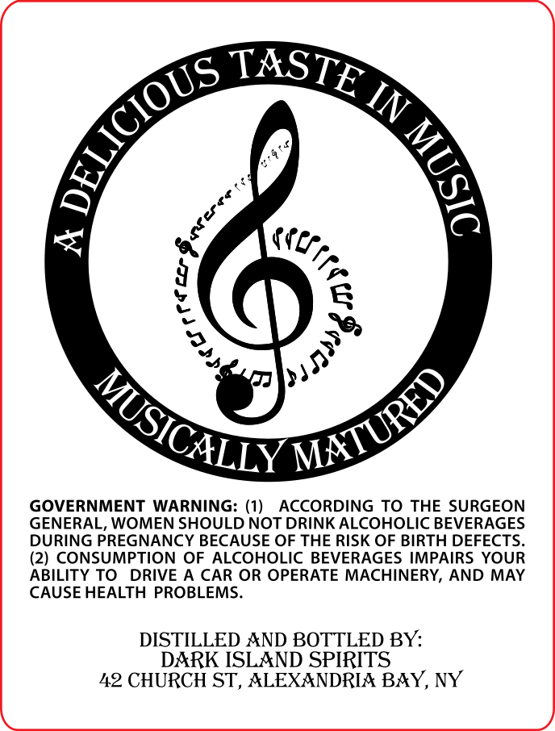

# TTB COLA Label Images - TTBID 26194001000814

**Brand Name:** DARK ISLAND

**Issue Date:** 08/18/2026

**Origin Code:** 02

**Product Class/Type:** 149

**Source:** [TTB Public COLA Registry](https://ttbonline.gov/colasonline/viewColaDetails.do?action=publicFormDisplay&ttbid=26194001000814)

## Label Images

### Back Label

### Front Label

### Label 2

## Extracted Label Text

*Text extracted via OCR - may contain errors*

*1 image(s) excluded: text did not meet readability threshold*

**Detected Proof:** 140

### Back Label

3
GOVERNMENT
WARNING: (1)
ACCORDING TO THE SURGEON
GENERAL, WOMEN SHOULD NOT DRINK ALCOHOLIC BEVERAGES
DURING PREGNANCY BECAUSE OF THE RISK OF BIRTH DEFECTS_
(2) CONSUMPTION OF ALCOHOLIC BEVERAGES IMPAIRS YOUR
ABILITY TO
DRIVE
A CAR OR OPERATE MACHINERY, AND MAY
CAUSE HEALTH PROBLEMS
DISTILLED AND BOTTLED BY:
DARK ISLAND SPIRITS
42 CHURCH ST, ALEXANDRIA BAY, NY
TASTE
DELICIOUS
IN
5
{
9
Je
MATURED
MUSICALLY

### Label 2

1
BUTTER PECEN
8
0
F
Butter Pecan Flavored Malt Whiskey
Musicalya
Matured to The Phantom Piper
Alc/Vol
(70 Proof)
750ml
