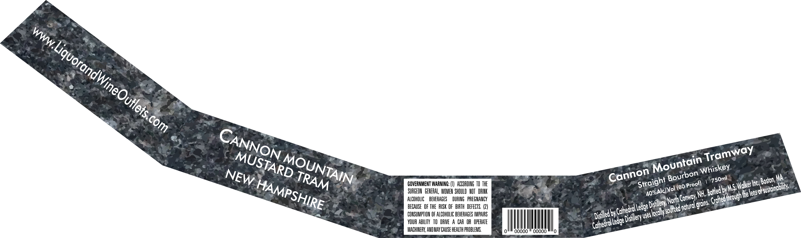
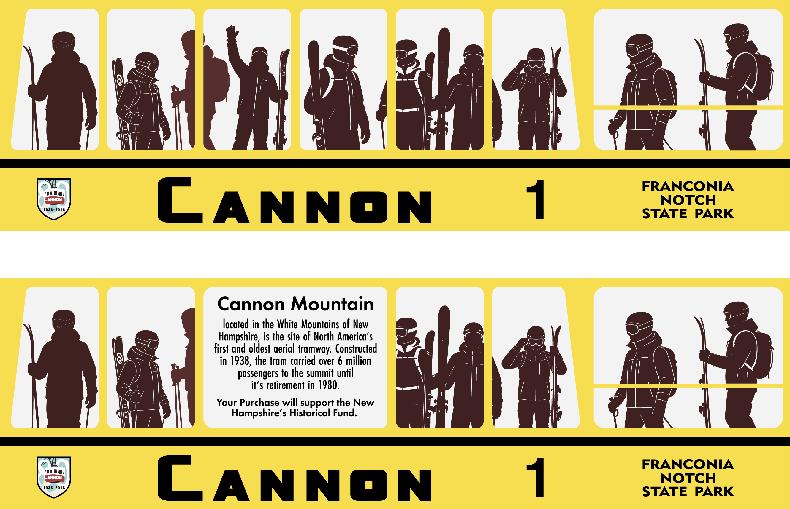

# TTB COLA Label Images - TTBID 26195001000052

**Brand Name:** CANNON MOUNTAIN TRAMWAY

**Issue Date:** 07/22/2026

**Origin Code:** 26

**Product Class/Type:** 101

**Source:** [TTB Public COLA Registry](https://ttbonline.gov/colasonline/viewColaDetails.do?action=publicFormDisplay&ttbid=26195001000052)

## Label Images

### Label 1

### Label 2

## Extracted Label Text

*Text extracted via OCR - may contain errors*

### Label 1

MA
GOVERNMENT WARNING: (1}  ACCOHDIG TO THE
Inc,
SURGEOU   GEHERAL, WOMEU ShOULD  NOT  IBINK
byMs;
lens or
ALCOhOLIC
BEVERAGES
DURING   pREGNANCY
Norh Conwoy NH
J irovghlhe!
bECAUSE   OF the  BISK  OF  HIRTH  DEFECTS  (2)
Ledge|
CONSUMPTHON OF ALCOHOLIC BEVERAGES IMPAIHS
by"
(Uses
YUR Abilty   tO DBIVE
A CAR OR  OPERATE
Ledgel
MACHINEFK, ANDMAY CAUSE HEALTH PROBLEMS
Ooo
Ooooo
WWW:
LiquorandWineOutlets
'com
CANNON
Tramway
MUSTARD
MOUNTAIN
Mountain
Whiskey
Cannon
NEW
Bourbon
TRAM
750ml
Straight
Boston; _
Proof)
HAMPSHIRE
Wolker L
Esustoinabllity:
(80
4o%Alc/ Vol !
Bolled|
Crotted}
Disflery '
grains,
Inoturdl _
(Sourced _
Cothedral L
locolly =
Disflled E
Disfllery !
Cothedral L

### Label 2

ets

CANNON

sl

CANNON

NOTCH
STATE PARK

1 FRANCONIA

Cannon Mountain

located in the White Mountains of New
Hampshire, is the site of North America’s
first and oldest aerial tramway. Constructed
in 1938, the tram carried over 6 million
passengers to the summit until
it’s retirement in 1980.

Your Purchase will support the New
Hampshire’s Historical Fund.

NOTCH
STATE PARK

1 FRANCONIA
