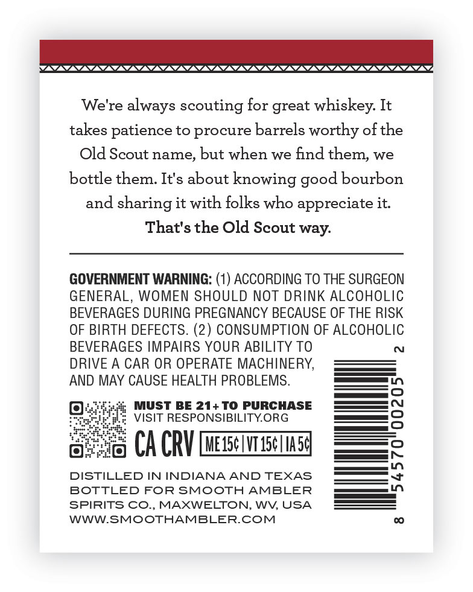
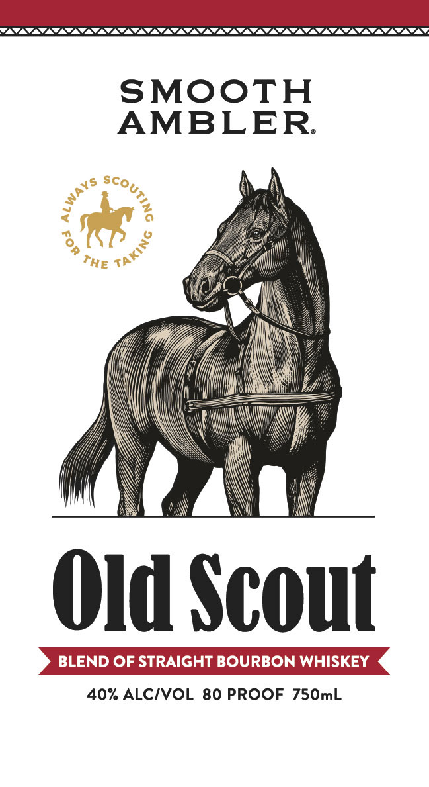

# TTB COLA Label Images - TTBID 26195001000163

**Brand Name:** SMOOTH AMBLER

**Issue Date:** 07/28/2026

**Origin Code:** 22

**Product Class/Type:** 121

**Source:** [TTB Public COLA Registry](https://ttbonline.gov/colasonline/viewColaDetails.do?action=publicFormDisplay&ttbid=26195001000163)

## Label Images

### Back Label

### Front Label

## Extracted Label Text

*Text extracted via OCR - may contain errors*

**Detected Proof:** 80

### Back Label

We'
always scouting for great whiskey: It
takes patience to procure barrels worthy ofthe
Old Scout name; but when we find them;
bottle them. It's about knowing good bourbon
and sharing it with folks who appreciate it
That's the Old Scout way:
GOVERNMENT WARNING: (1) ACCORDING TO THE SURGEON
GENERAL, WOMEN SHOULD NOT DRINK ALCOHOLIC
BEVERAGES DURING PREGNANCY BECAUSE OF THE RISK
OF BIRTH DEFECTS. (2) CONSUMPTION OF ALCOHOLIC
BEVERAGES IMPAIRS YOUR ABILITY TO
DRIVE A CAR OR OPERATE MACHINERY,
AND MAY CAUSE HEALTH PROBLEMS
MUST BE 21+ TO PURCHASE
3
VISIT RESPONSIBILITYORG
CA CRV MeIscwIsc1m5]
DISTILLED IN INDIANA AND TEXAS
7
BOTTLED FOR SMOOTH AMBLER
SPIRITS CO., MAXWELTON, WV USA
WWWSMOOTHAMBLERCOM
e're
we

### Front Label

SMOOTH
AMBLER
Old Scout
BLEND OF STRAIGHT BOURBON WHISKEY
40% ALCIVOL 80 PROOF 750mL
SCOU
WAYS
TAKING
THE
