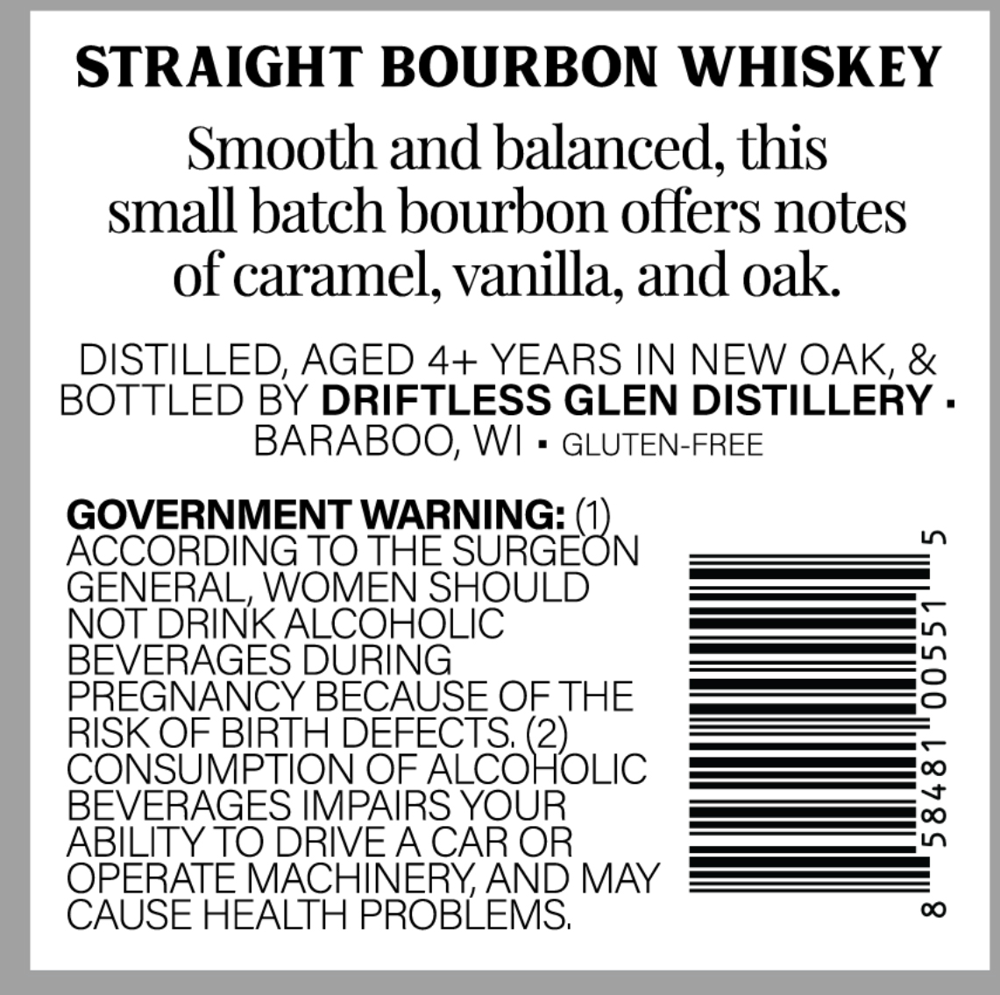
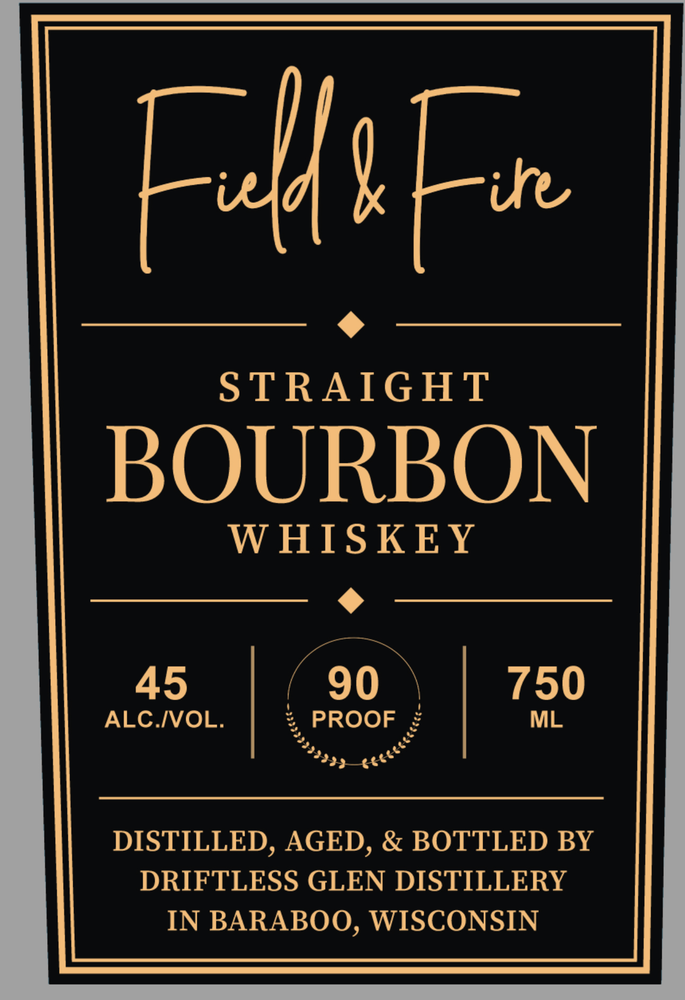

# TTB COLA Label Images - TTBID 26195001000402

**Brand Name:** FIELD & FIRE

**Issue Date:** 07/17/2026

**Origin Code:** 48

**Product Class/Type:** 101

**Source:** [TTB Public COLA Registry](https://ttbonline.gov/colasonline/viewColaDetails.do?action=publicFormDisplay&ttbid=26195001000402)

## Label Images

### Back Label

### Front Label

## Extracted Label Text

*Text extracted via OCR - may contain errors*

### Back Label

STRAIGHT BOURBON WHISKEY
Smooth and balanced,this
small batch bourbon offers notes
of caramel; vanilla; and oak
DISTILLED; AGED 4+ YEARS IN NEW OAK, &
BOTTLED BY DRIFTLESS GLEN DISTILLERY .
BARABOO; WI
GLUTEN-FREE
GOVERNMENT WARNING:
1
ACCORDING TO THE SURGEON
GENERAL, WOMEN SHOULD
NOT DRINK ALCOHOLIC
BEVERAGES DURING
2
PREGNANCY BECAUSE OF THE
RISK OF BIRTH DEFECTS, (2)
CONSUMPTION OF ALCOHOLIC
BEVERAGES IMPAIRS YOUR
1
ABILITY TO DRIVEA CAR OR
OPERATE MACHINERYAND MAY
CAUSE HEALTH PROBLEMS;
00

### Front Label

FHFu
STRAIGHT
BOURBON
W HISKEY
45
90
750
ALC IVOL.
PROOF
ML
DISTILLED, AGED, & BOTTLED BY
DRIFTLESS GLEN DISTILLERY
IN BARABOO, WISCONSIN
