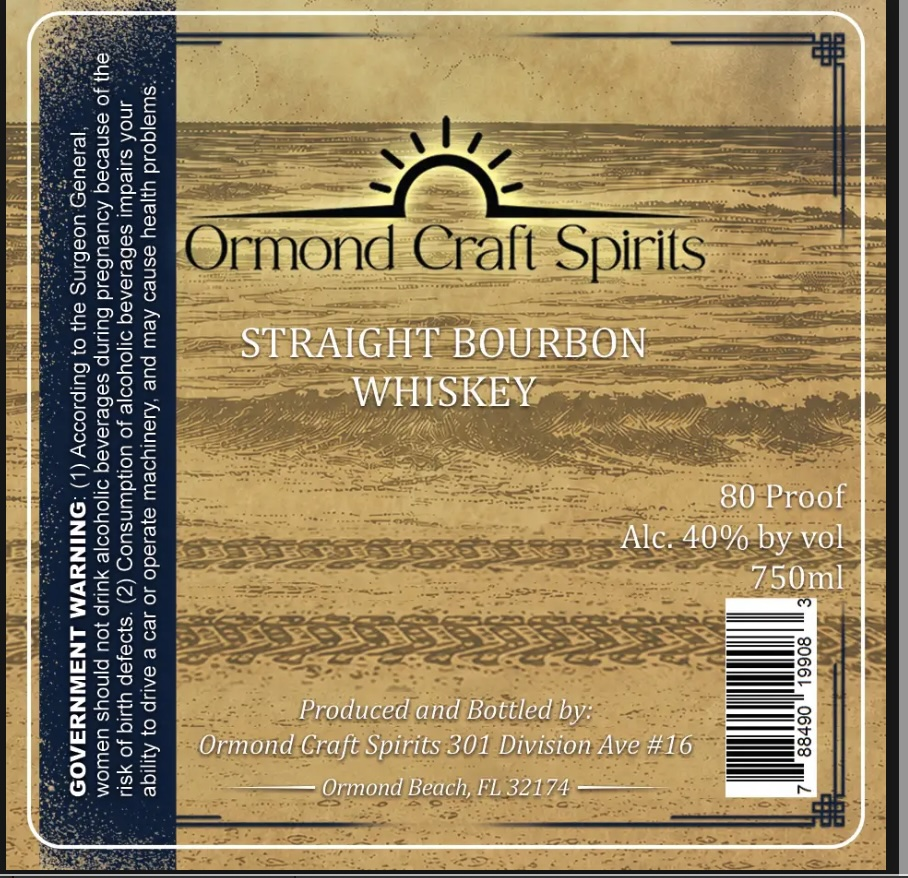
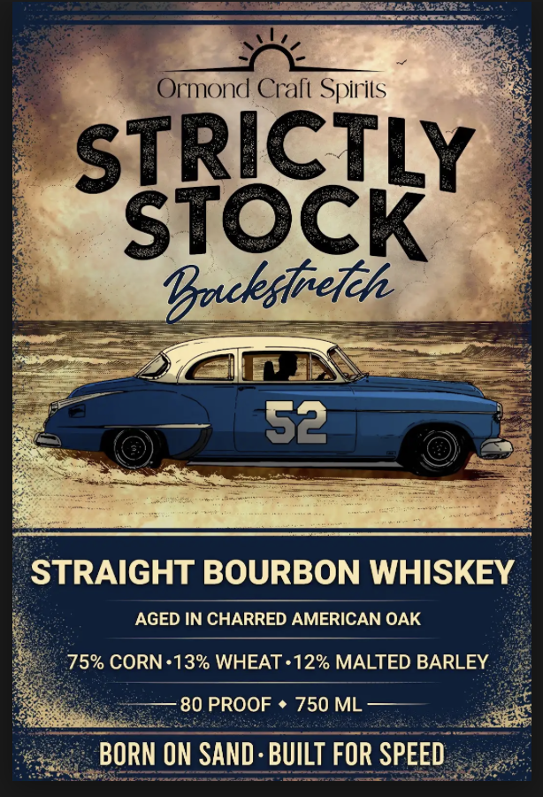

# TTB COLA Label Images - TTBID 26195001000437

**Brand Name:** ORMOND CRAFT SPIRITS

**Fanciful Name:** STRICTLY STOCK STRAIGHT BOURBON WHISKEY

**Issue Date:** 07/16/2026

**Origin Code:** 16

**Product Class/Type:** 101

**Source:** [TTB Public COLA Registry](https://ttbonline.gov/colasonline/viewColaDetails.do?action=publicFormDisplay&ttbid=26195001000437)

## Label Images

### Back Label

### Front Label

## Extracted Label Text

*Text extracted via OCR - may contain errors*

**Detected Proof:** 80

### Back Label

2
6
JLH

H
Ormond Craft Spirits
2
3
2
STRAIGHT BOURBON
1
3
WHISKEY
D
6
[
U
Alc: 4080 broof
1
{~8
750ml
2
8
9
g
1
I
2
Produced and Bottled by:
8
3
Ormond Craft Spirits 301 Division Ave #16
0
Ormond Beach, FL32174

### Front Label

Ormond Crali Spirils
STRICTLY
STOCK
'ackstreteh
52
STRAIGHT BOURBON WHISKEY
AGED IN CHARRED AMERICAN OAK
75% CORN.13% WHEAT .12% MALTED BARLEY
80 PROOF
750 ML
BORN ON SAND : BUILT FOR SPEED
