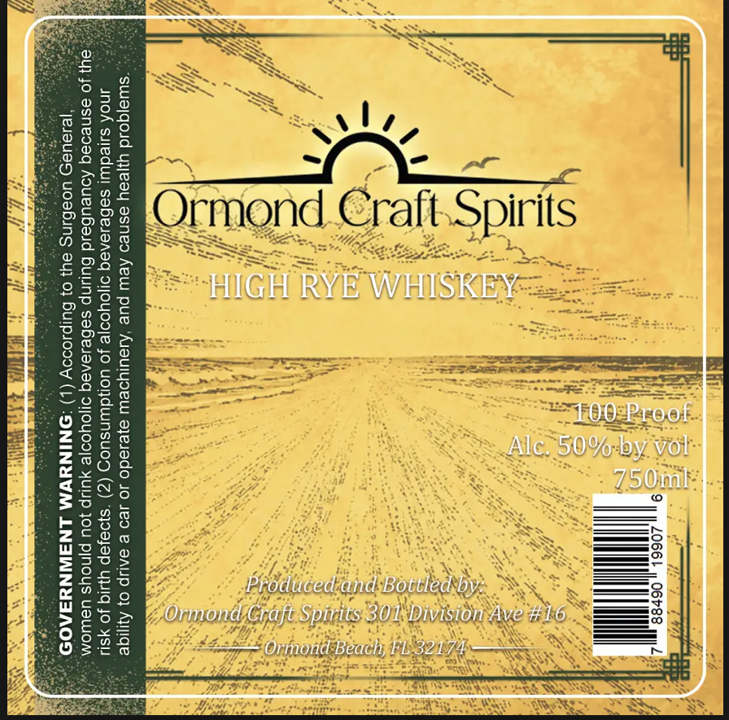
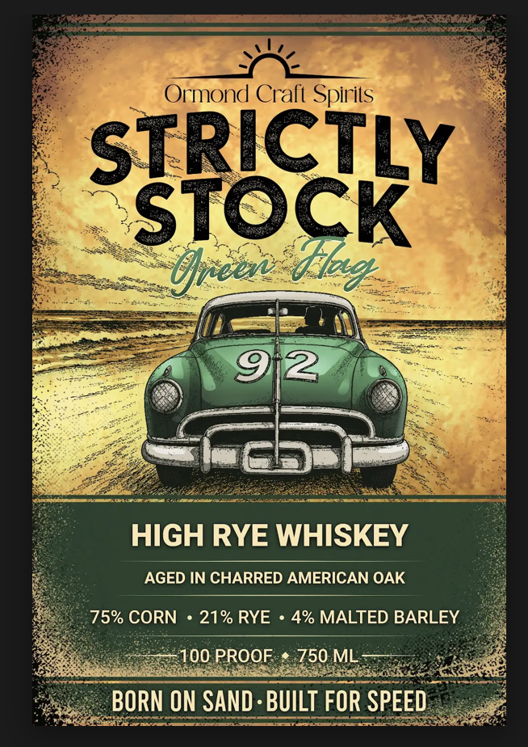

# TTB COLA Label Images - TTBID 26195001000443

**Brand Name:** ORMOND CRAFT SPIRITS

**Fanciful Name:** STRICTLY STOCK HIGH RYE WHISKEY

**Issue Date:** 07/16/2026

**Origin Code:** 16

**Product Class/Type:** 142

**Source:** [TTB Public COLA Registry](https://ttbonline.gov/colasonline/viewColaDetails.do?action=publicFormDisplay&ttbid=26195001000443)

## Label Images

### Back Label

### Front Label

## Extracted Label Text

*Text extracted via OCR - may contain errors*

*1 image(s) excluded: text did not meet readability threshold*

**Detected Proof:** 100

### Front Label

Ormond Crafi Spirils
STRICTLY
STOCK
Ufreen
2
HIGH RYE WHISKEY
AGED IN CHARRED AMERICAN OAK
75% CORN
21% RYE
4% MALTED BARLEY
100 PROOF
750 ML
BORN ON SAND : BUILT FOR SPEED
"dkod
