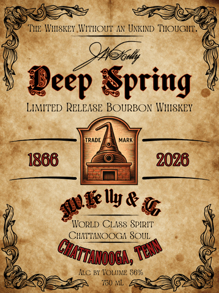
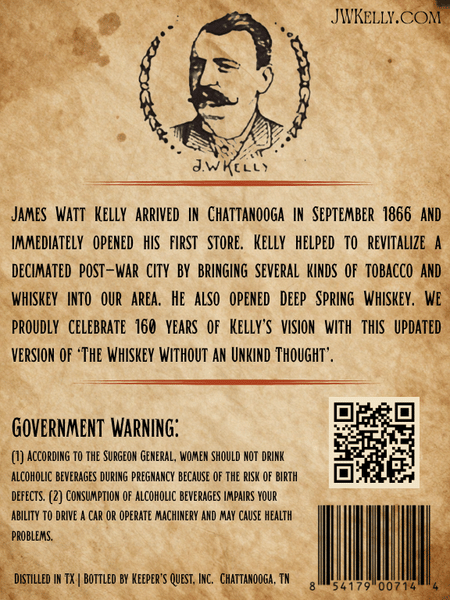

# TTB COLA Label Images - TTBID 26195001000448

**Brand Name:** J.W. KELLY & CO DEEP SPRING

**Fanciful Name:** LIMITED RELEASE BOURBON WHISKEY

**Issue Date:** 07/21/2026

**Origin Code:** 43

**Product Class/Type:** 141

**Source:** [TTB Public COLA Registry](https://ttbonline.gov/colasonline/viewColaDetails.do?action=publicFormDisplay&ttbid=26195001000448)

## Label Images

### Label 1

### Label 2

### Label 3

## Extracted Label Text

*Text extracted via OCR - may contain errors*

*1 image(s) excluded: text did not meet readability threshold*

### Label 1

THE WHSKEY WVITHOUT AN UNKIND 'TOUGHT.
Jeep Spring
LIMITED RELEASE BOURBON INHISKEY
TRADE
MARK
1866
2026
Ilye&
WORLD CLASS SPIRIT'
CHTTANOOGA SOUL
ALc By VOLUIME 56%
'750 ML;
Wlet
Guantaooal ,
Te

### Label 3

JIKELLY.COM
James   Watt   Kelly  Arrived  IN  Chattanooga
IN  September   1866   AND
Immediately   Opened   hIS   FlRST   Store_
Kelly   helped   to   revitallze
decIMATed  poST-War City BY  BRINGING several  KINDS Of  tObacco and
WhISKeY   INTO   OUR   area,
he also   Opened  Deep  SPrInG   WhISKEY,  We
proudly   celebrate  160   years   Of   Kelly"s  VISION   WITh thIS   updated
VERSIOM OF 'THE WhiskeY WIthout AN UNKIND ThOUGHT ' ,
GOVERNMENT WARNING;
ACCORdINg TO THE Surgeom General; WO,er ShOuld NOT drINk
alCOHOLIC beverages DURING pregnancy because €F thE RISK €F BRTh
defects
CORSUMPTION OF ALCOHOLIC beverages IPaRS VOUR
ABILITY TO drIve
Car or operate MachineRY Ad MaY CauSE health
probleMS:
destilled IM TX |
bottled BY Keeper's QueST, INC,
chattaoOga;
