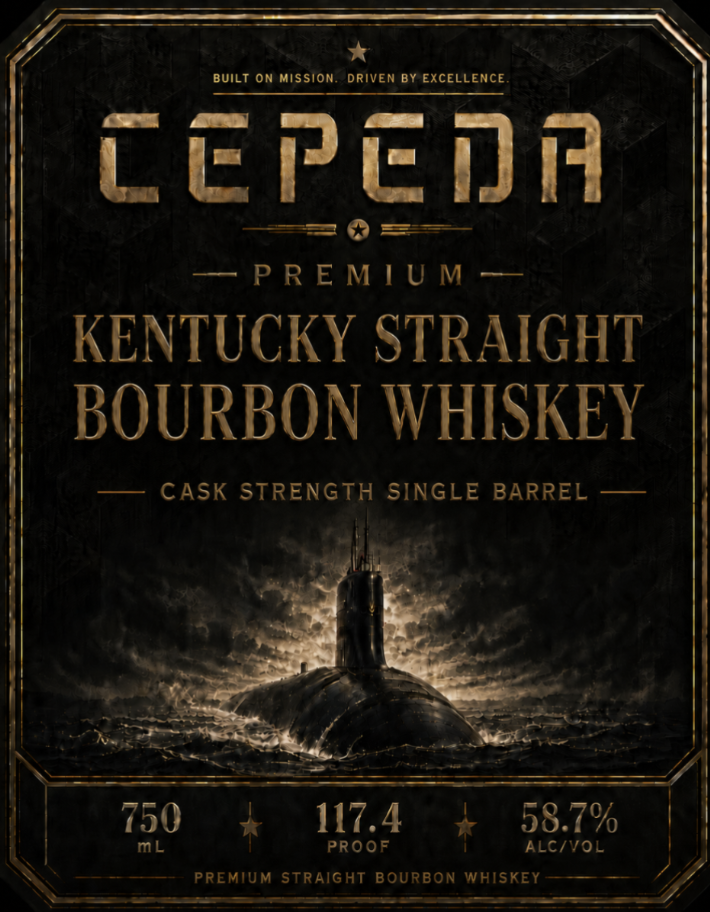
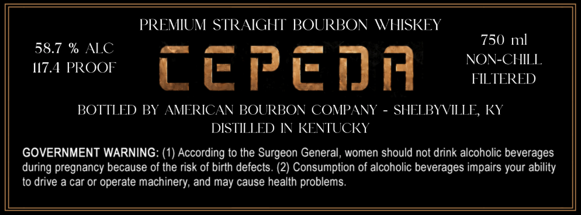

# TTB COLA Label Images - TTBID 26195001000472

**Brand Name:** CEPEDA

**Issue Date:** 07/28/2026

**Origin Code:** 22

**Product Class/Type:** 101

**Source:** [TTB Public COLA Registry](https://ttbonline.gov/colasonline/viewColaDetails.do?action=publicFormDisplay&ttbid=26195001000472)

## Label Images

### Label 1

### Label 2

## Extracted Label Text

*Text extracted via OCR - may contain errors*

**Detected Proof:** 117.4

### Label 1

BUILT ON Mission
DRIVEN BY EXCELLENCE
Lepeia
P R E M ! U M
KENTUCKY STRAIGHT
BOURBON WHISKEY
CASK STRENGTH SINGLE BARREL
750
117.4
58.7%
mL
PROOF
ALC/VOL
PREMIUM STRAIGHT BOURBON WHISKEY

### Label 2

PREMIUM STRAIGHT BOURBON WHISKEY
750
ml
58.7 % ALC
NOV-CHIL
1I7.4 PROOF
cepedn
FILTERED
BOTTLED BY
AMERICAN BOURBON COMPANY
SHELBYVILLE, KY
DISTILLED IN KENTUCKY
GOVERNMENT WARNING: (1) According to the Surgeon General, women should not drink alcoholic beverages
during pregnancy because of the risk of birth defects. (2) Consumption of alcoholic beverages impairs your
to drive a car or operate machinery; and may cause health problems.
ability
