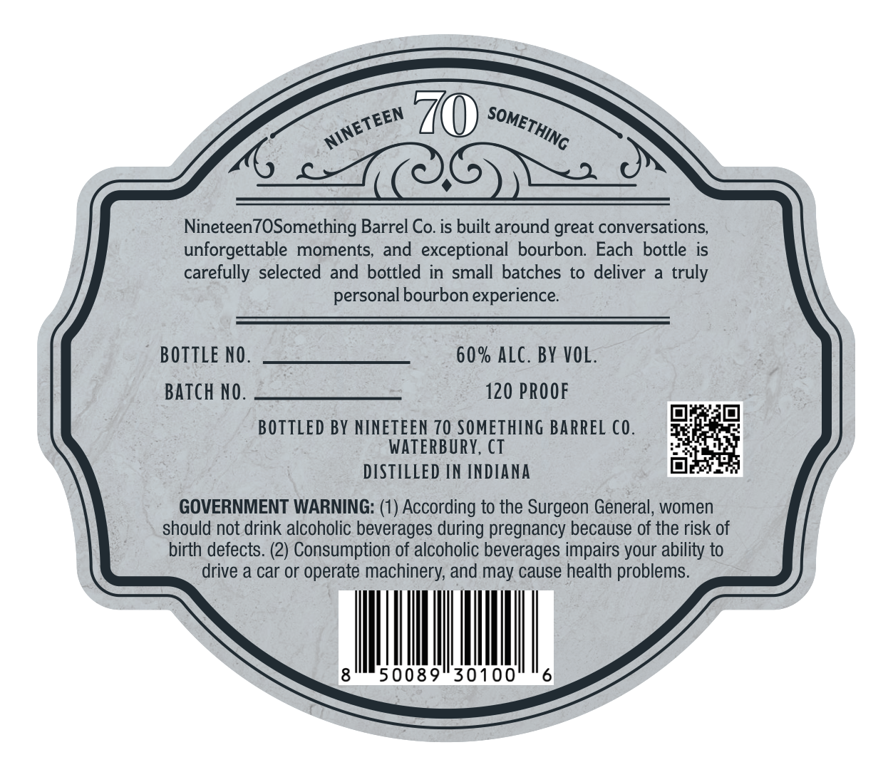
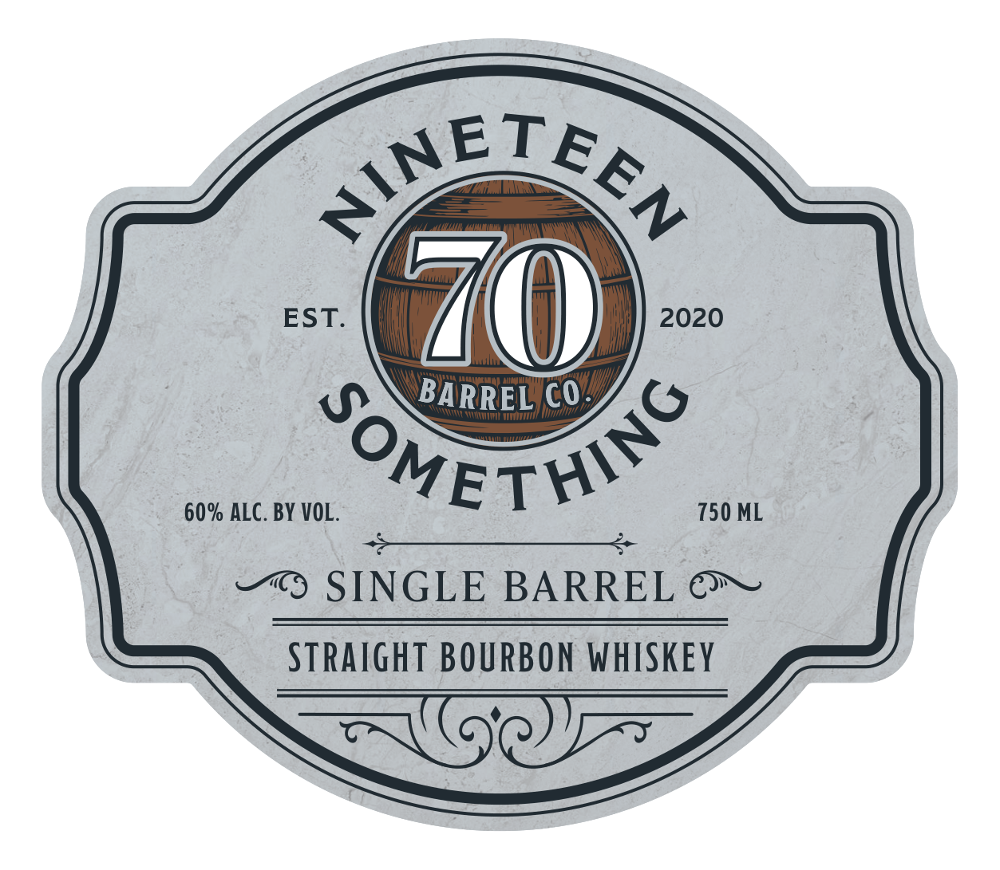

# TTB COLA Label Images - TTBID 26195001000475

**Brand Name:** NINETEEN70SOMETHING

**Issue Date:** 07/16/2026

**Origin Code:** 14

**Product Class/Type:** 101

**Source:** [TTB Public COLA Registry](https://ttbonline.gov/colasonline/viewColaDetails.do?action=publicFormDisplay&ttbid=26195001000475)

## Label Images

### Back Label

### Front Label

## Extracted Label Text

*Text extracted via OCR - may contain errors*

**Detected Proof:** 120

### Back Label

Nineteen7OSomething Barrel Co. is built around great conversations,
unforgettable  moments,
and
exceptional bourbon: Each bottle is
carefully selected and bottled in small batches to deliver
truly
personal bourbon experience
BOTTLE NO.
60% ALC. BY VOL.
BAtch NO.
120 PROOF
BOTTLED BY NINETEEN 70 SOMETHING BARREL C0.
WATERBURY, CT
DISTILLED [N INDIANA
GOVERNMENT WARNING: (1) According to the Surgeon General, women
should not drink alcoholic beverages during pregnancy because of the risk of
birth defects. (2) Consumption of alcoholic beverages impairs your ability to
drive a car or operate machinery; and may cause health problems.
8
50089"30100
6
NINETEEN
SOMETHING

### Front Label

ETE

S

EST.

2020

BARREL C0

ET

‘S

60% ALC. BY VOL.

750 ML

—“) SINGLE BARREL &~

STRAIGHT BOURBON WHISKEY

SWE
