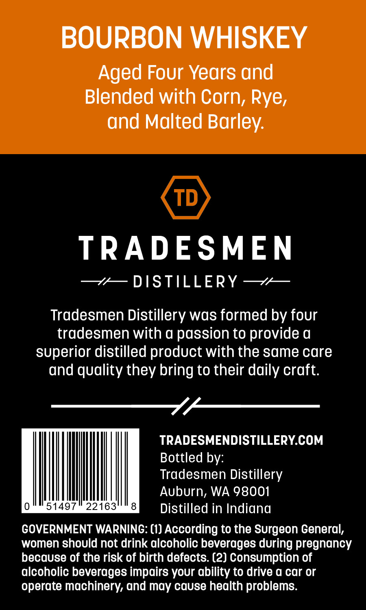
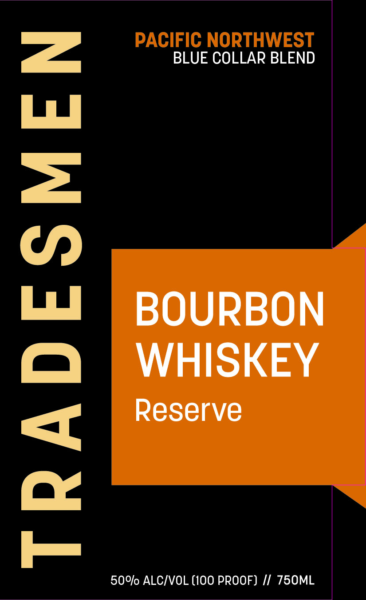

# TTB COLA Label Images - TTBID 26195001000503

**Brand Name:** TRADESMEN

**Fanciful Name:** BOURBON
RESERVE

**Issue Date:** 08/10/2026

**Origin Code:** 07

**Product Class/Type:** 141

**Source:** [TTB Public COLA Registry](https://ttbonline.gov/colasonline/viewColaDetails.do?action=publicFormDisplay&ttbid=26195001000503)

## Label Images

### Back Label

### Front Label

### Label 4

## Extracted Label Text

*Text extracted via OCR - may contain errors*

*1 image(s) excluded: text did not meet readability threshold*

### Back Label

BOURBON WHISKEY

Aged Four Years and
Blended with Corn, Rye,
and Malted Barley.

TRADESMEN

—v— DISTILLERY —*—

Tradesmen Distillery was formed by four
tradesmen with a passion to provide a
superior distilled product with the same care
and quality they bring to their daily craft.

Ylme—r-

TRADESMENDISTILLERY.COM

Bottled by:

Tradesmen Distillery

Auburn, WA 98001
eee ake = Distilled in Indiana
GOVERNMENT WARNING: (1) According to the Surgeon General,
women should not drink alcoholic beverages during pregnancy
because of the risk of birth defects. (2) Consumption of
alcoholic beverages impairs your ability to drive a car or
operate machinery, and may cause health problems.

### Front Label

TRADESMEN

BLUE COLLAR BLEND

BOURBON
WHISKEY

Reserve
