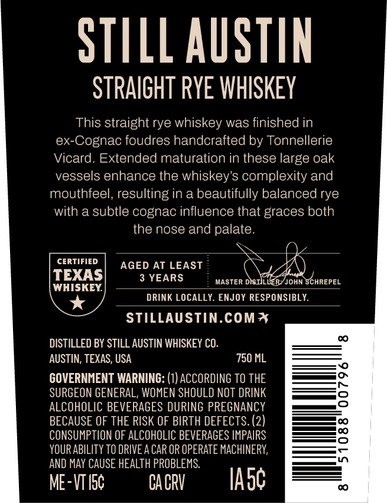
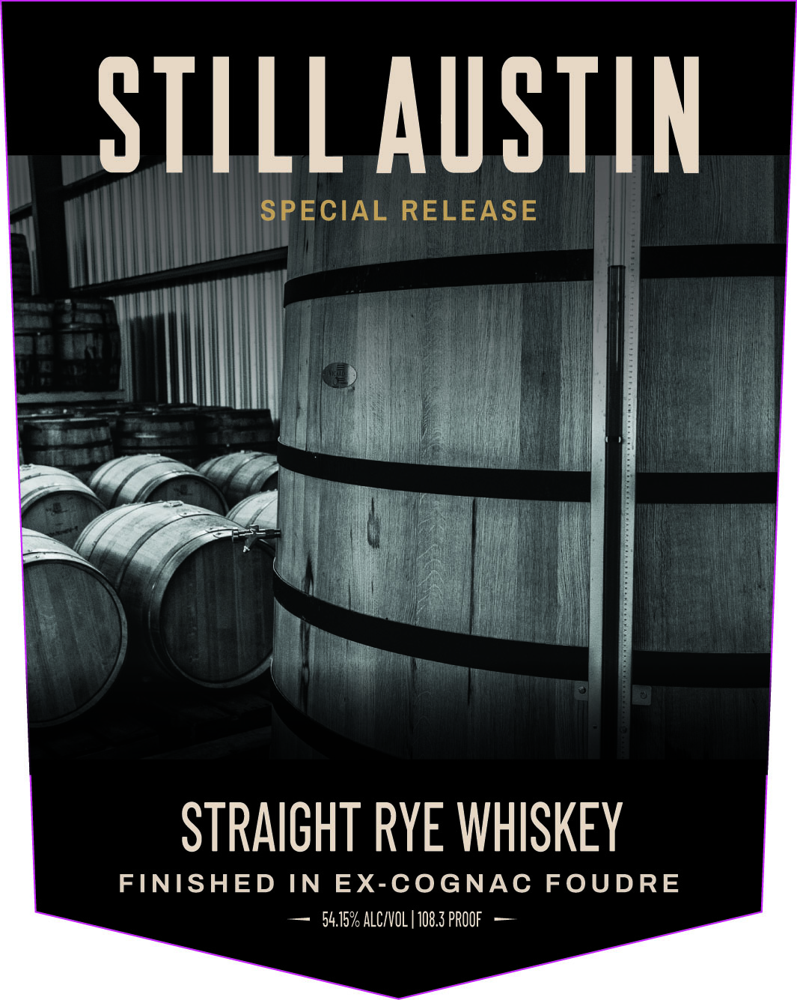
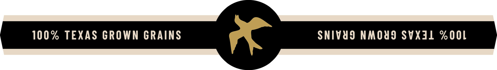

# TTB COLA Label Images - TTBID 26195001000505

**Brand Name:** STILL AUSTIN

**Fanciful Name:** SPECIAL RELEASE

**Issue Date:** 07/24/2026

**Origin Code:** 44

**Product Class/Type:** 102

**Source:** [TTB Public COLA Registry](https://ttbonline.gov/colasonline/viewColaDetails.do?action=publicFormDisplay&ttbid=26195001000505)

## Label Images

### Back Label

### Front Label

### Label 2

## Extracted Label Text

*Text extracted via OCR - may contain errors*

**Detected Proof:** 109.5
**Detected Age:** 3 Years

### Back Label

STILL AUSTIN
STPAICHT RYE WHISKEY
This straight rye whiskey was finished in
ex-Cognac foudres handcrafted by Tonnellerie
Vicard. Extended maturation in these large oak
vessels enhance the whiskey's complexity and
mouthfeel, resulting in a beautifully balanced rye
with a subtle cognac influence that graces both
the nose and palate
CERTIFIED
AGED AT LEAST
TEXAS
3 YEARS
MASTER DISIILLIERYJOHN SCHREPEL
WHISKEY
DRINK LOCALLY. ENJOY RESPONSIBLY:
STILLAUSTIN.COMI
DISTILLED BY STILL AUSTIN WHISKEY CO:
AUSTIN, TEXAS, USA
750 ML
GOVERNMENT WARNING: (1) ACCORDING TO THE
SURGEON GENERAL, WOMEN SHOULD NOT DRINK
ALCOHOLIC BEVERAGES DURING PREGNANCY
BECAUSE OF THE RISK OF BIRTH DEFECTS: (2)
CONSUMPTION OF ALCOHOLIC BEVERAGES IMPAIRS
8
YOUR ABILITY TO DRIVE A CAR OR OPERATE MACHINERY,
AND May CAUSE HEALTH PROBLEMS:
ME-VT Isc
CA CRV
Iasc

### Front Label

StiLLAuSTIN
SPECIAL RELEASE
STRAICHT RYE WHISKEY
FNISHED IN
EX-COGNAC
FOUDRE
54.75% ALCIVOL | 108.3 PROOF

### Label 2

100% TEXAS GROWN GRAINS

SNIVYS NMOUD SVXAL ZOOL
