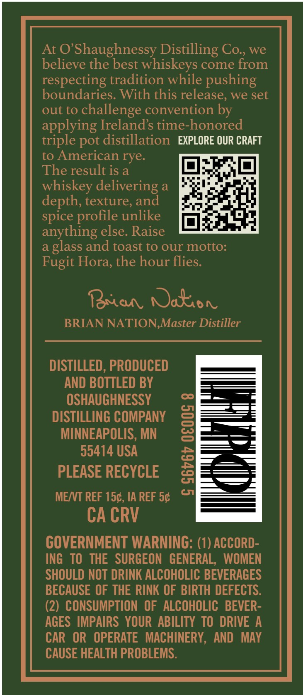
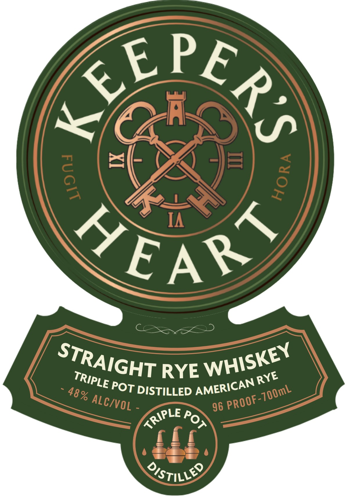
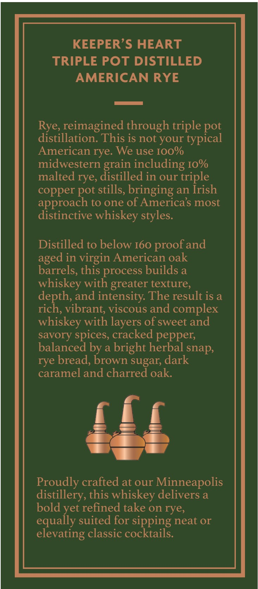

# TTB COLA Label Images - TTBID 26195001000511

**Brand Name:** KEEPER'S HEART

**Issue Date:** 07/16/2026

**Origin Code:** 27

**Product Class/Type:** 102

**Source:** [TTB Public COLA Registry](https://ttbonline.gov/colasonline/viewColaDetails.do?action=publicFormDisplay&ttbid=26195001000511)

## Label Images

### Back Label

### Label 1

### Label 3

## Extracted Label Text

*Text extracted via OCR - may contain errors*

**Detected Proof:** 96

### Back Label

At 0 Shaughnessy Distilling Co , we
believe the best whiskeys come from
respecting tradition while pushing
boundaries. With this release; we set
out to
challenge convention by
applying Irelands time-honored
triple pot distillation  EXPLORE OUR CRAFT
to American rye.
The result is a
whiskey delivering a
depth, texture, and
spice profile unlike
anything else. Raise
a
glass and toast to our motto:
Fugit Hora, the hour flies:
Raaa Nakon
BRIAN NATION,Master Distiller
DISTILLED, PRODUCED
AND BOTTLED BY
OSHAUGHNESSY
DISTILLING COMPANY
3
MINNEAPOLIS, MN
55414 USA
PLEASE RECYCLE
1
MENT REF 150, IA REF 5c
CA CRV
GOVERNMENT WARNING: (1) ACCORD-
ING TO  THE   SURGEON   GENERAL,  WOMEN
SHOULD NOT DRINK ALCOHOLIC BEVERAGES
BECAUSE OF THE RINK OF BIRTH DEFECTS:
(2) CONSUMPTION OF ALCOHOLIC  BEVER-
AGES  IMPAIRS   YOUR ABILITY TO DRIVE A
CAR   OR   OPERATE   MACHINERY, AND   MAY
CAUSE HEALTH PROBLEMS:

### Label 1

Repea
4
E
A L
IA
KEARS
RYE
DISTILLED
96
OstiLLeQ
2
3
WHISKEY
STRAIGHT
TRIPLE
RYE
AMERICAN
POT
PROOF-70OmL
48%
ALC/VOL
KRIPLE
Pot

### Label 3

KEEPER'S HEART
TRIPLE POT DISTILLED
AMERICAN RYE
Rye,reimagined through triple pot
distillation: This is not your
typical
American rye. We use Ioo%
midwestern
including Io%
malted rye, distilled in our triple
copper pot stills, bringing an Irish
approach to one of Americas most
distinctive whiskey
Distilled to below I60
and
in virgin American oak
barrels, this process builds a
whiskey with greater texture,
depth; and intensity The result is a
rich; vibrant; viscous and
complex
whiskey with layers of sweet and
savory spices, cracked pepper;
balanced by a bright herbal snap;
rye bread; brown sugar; dark
caramel and charred oak:
Proudly crafted at our Minneapolis
distillery, this whiskey delivers a
bold yet refined take on rye,
equally suited for sipping neat or
elevating classic cocktails.
grain
styles.
proof =
aged
