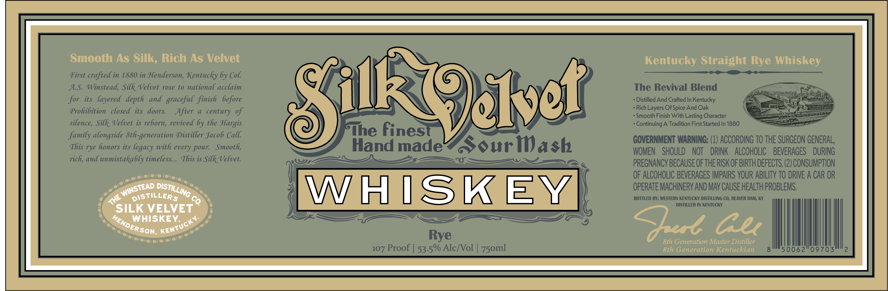
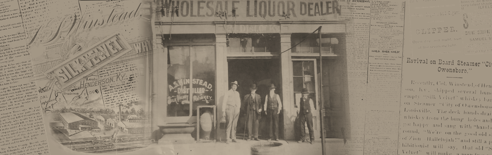

# TTB COLA Label Images - TTBID 26195001000540

**Brand Name:** SILK VELVET WHISKEY

**Fanciful Name:** RYE

**Issue Date:** 07/17/2026

**Origin Code:** 22

**Product Class/Type:** 102

**Source:** [TTB Public COLA Registry](https://ttbonline.gov/colasonline/viewColaDetails.do?action=publicFormDisplay&ttbid=26195001000540)

## Label Images

### Label 1

### Label 2

## Extracted Label Text

*Text extracted via OCR - may contain errors*

**Detected Proof:** 107

### Label 1

Smooth As Silk; Rich As Velvet
Kentucky Straight Rye Whiskey
First crafted in 1880 in Henderson, Kentucky by Col
AS: Winstead, Silk Velvet rose to national acclaim
The Revival Blend
for its   layered   depth   and   graceful finish   before
ROeldk
Distilled And Crafted In Kentucky
Prohibition
closed its   doors:
After
century of
Rich Layers Of Spice And Oak
Smooth Finish With
Character
silence, Silk Velvet is reborn, revived 6y the Hargis
Continuing A Tradition First Started In 1880
family alongside Sth-generation Distiller Jacob Call
The finest
GOVERNMENT WARNING: (1) ACCORDING TO THE SURGEON GENERAL,
This rye honors its
pour:
Smooth,
Hand madel
Souriash
WOMEN   SHOULD
NOT
DRINK
ALCOHOLIC
BEVERAGES
DURING
rich, and unmistakably timeless__. This is Silk Velvet.
PREGNANCY BECAUSE OFTHE RISK OF BIRTH DEFECTS (2) CONSUMPTION
OF ALCOHOLIC BEVERAGES IMPAIRS VOUR ABILITY TO DRIVE A CAR OR
WHISKEY
OPERATE MACHINERY AND MAV CAUSE HEALTH PROBLEMS,
DiStiLLERS
BOTTLED BY: WESTERN KENTUCKY DISTILLING CO; BEAVER DAM; KY
DISTILLED IN KENTUCKY
SILK VELVET
WHISKEY:
Oel Gu
Rye
8th Generation Master Distiller
107 Proof | 53.5% AlcfVol
8th Generation Kentuckian
'50062"09703
Lasting '
with
legacy
every
WINSTEAD .
DISTILLING
THE
Co
HENDE
KENTUCKY:
ERSON;
75oml

### Label 2

#VOLES44 F LHQUQR DEALER
6
CLiPPBr
01' -
''
. . .'
SAMUEL
. .
Maclit: Vi-Ie
Eovival on Caurd Steamor
Owonoboro_
Iaths
"l
mmvloMl;
Jlica
Ka
Ea Duattn
1v1a1
Iui
Mtoxey
7'M %
Rilk
#hi-ko
71,11'1
6"e
Ii-Filla.
T
I;-
0I-k /
Traauf (lic
Iolv J
"#l ~"
WWi "6l
1
uae
7 W
Mahlelnjal
J
still
hilitioni-l
(aj (
in.skaol.
GIKZxI
e
nHENDERSON Kx;
ISTEAD,
1'
Hovo
1
iv ,
16
4
Innf
ll"''
