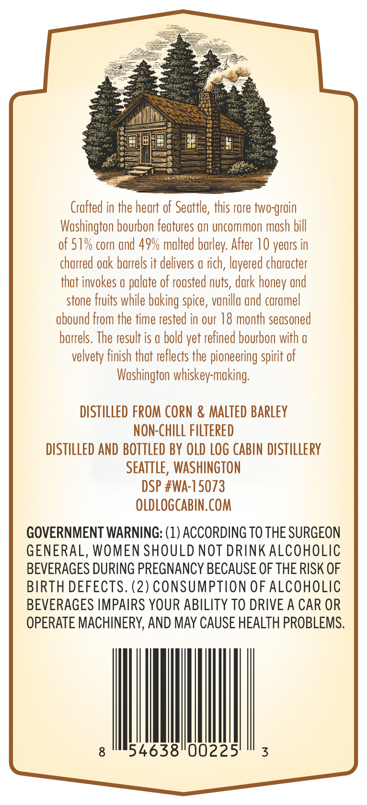
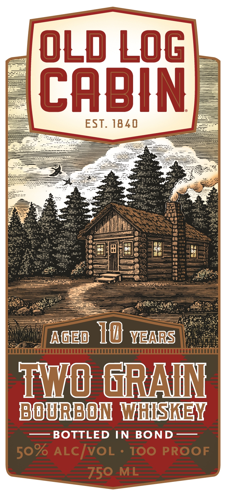

# TTB COLA Label Images - TTBID 26195001000559

**Brand Name:** OLD LOG CABIN

**Issue Date:** 07/27/2026

**Origin Code:** 07

**Product Class/Type:** 111

**Source:** [TTB Public COLA Registry](https://ttbonline.gov/colasonline/viewColaDetails.do?action=publicFormDisplay&ttbid=26195001000559)

## Label Images

### Back Label

### Front Label

## Extracted Label Text

*Text extracted via OCR - may contain errors*

**Detected Proof:** 100
**Detected Age:** 10 Years

### Back Label

Crafted in the heart of Seattle, this rare two-grain

Washington bourbon features an uncommon mash bill

of 51% corn and 49% malted barley. After 10 years in

charred oak barrels it delivers a rich, layered character

that invokes a palate of roasted nuts, dark honey and

stone fruits while baking spice, vanilla and caramel

abound from the time rested in our 18 month seasoned

barrels. The result is a bold yet refined bourbon with a

velvety finish that reflects the pioneering spirit of

Washington whiskey-making.

DISTILLED FROM CORN & MALTED BARLEY

NON-CHILL FILTERED

DISTILLED AND BOTTLED BY OLD LOG CABIN DISTILLERY

SEATTLE, WASHINGTON

DSP #WA-15073

OLDLOGCABIN.COM

GOVERNMENT WARNING: (1) ACCORDING TO THE SURGEON

GENERAL, WOMEN SHOULD NOT DRINK ALCOHOLIC

BEVERAGES DURING PREGNANCY BECAUSE OF THE RISK OF

BIRTH DEFECTS. (2) CONSUMPTION OF ALCOHOLIC

BEVERAGES IMPAIRS YOUR ABILITY TO DRIVE A CAR OR

OPERATE MACHINERY, AND MAY CAUSE HEALTH PROBLEMS

IM

### Front Label

OLd Log
CABIN
EST. 1840
#
#
hm
#n"Ie
M
in
Aqei
1W years
To} GaArN
Bourbon WHISREY
BOTTLED IN
BOND
ALcIvoL
100 PROOF
750 ML
50%
