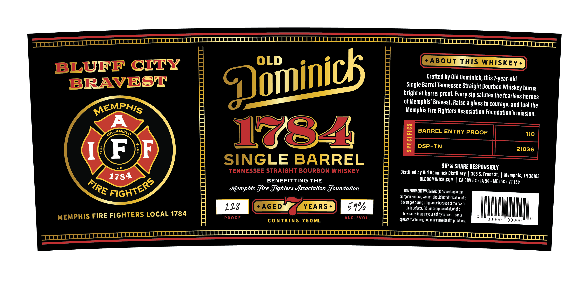
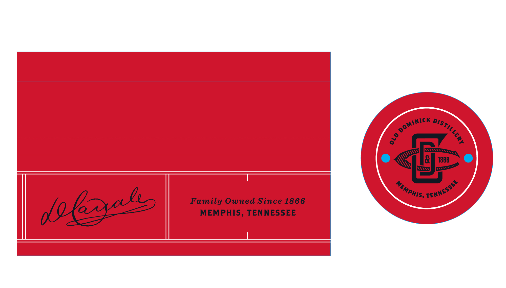

# TTB COLA Label Images - TTBID 26195001000570

**Brand Name:** OLD DOMINICK

**Fanciful Name:** 1784 SINGLE BARREL

**Issue Date:** 07/22/2026

**Origin Code:** 43

**Product Class/Type:** 101

**Source:** [TTB Public COLA Registry](https://ttbonline.gov/colasonline/viewColaDetails.do?action=publicFormDisplay&ttbid=26195001000570)

## Label Images

### Label 1

### Label 2

## Extracted Label Text

*Text extracted via OCR - may contain errors*

**Detected Proof:** 110

### Label 1

BLUFF CTTY
ABOuT THIS WhISKEY .
Crafted by Old Dominick, this /-year-old
BRAVEST
Single Barrel Tennessee Straight Bourbon Whiskey burns
brightat barrel proof Every sip Salutes the fearless heroes
of Memphis' Bravest; Raise a glass to courage, and fuel the
MEMPHIS
Memphis Fire Fighters Association Foundation's mission
A
GaGANIZED
1784
BARREL ENTRY PROOF
110
F
2
1
1
DSP_TN
21036
28
SINGLE BARREL
SIP & SHARE RESPONSIBLY
TENNESSEE STRAIGHT BOURBON WHISKEY
Distilled by Old Dominick Distillery
305 $. Front St,
1784
Memphis, TN 38103
BENEFITTING THE
OLDDOMINICK.COM
CA CRV S5c . IA 5c
ME 15c . VT 15c
Memphis Jire Jighters Association Joundation
GOVERNMENT WARNING: (1) According to the
Surgeon General, women should not drink alcoholic
beverages during pregnancy because ofthe risk of
128
AGED
YEARS
59%
birth defects;
Consumption ofalcoholic
MEMPHIS FIRE FIGHTERS LOCAL 1784
beverages impairs your ability to drive a car Or
PROoF
contAiNS
750ML
ALc. IVOL
operate machinery; and may cause health problems;
0000
00000
Qoininic
FIGHTERS
FIRE

### Label 2

1866
Family Owned Since 1866
MEMPHIS, TENNESSEE
DominicK _
DIstillery
8
TENNEsseE
MEMPHIS;`
62l5
d
