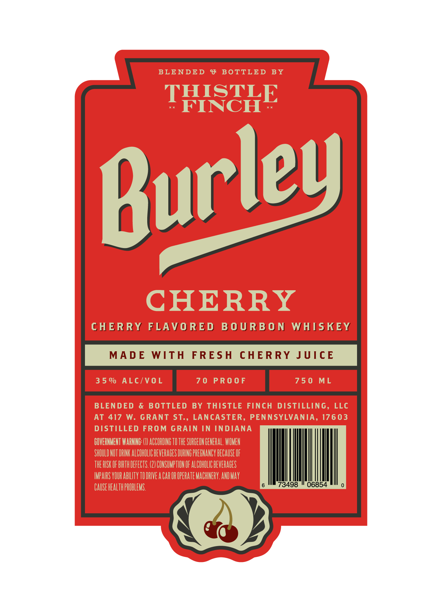

# TTB COLA Label Images - TTBID 26195001000644

**Brand Name:** BURLEY

**Issue Date:** 08/03/2026

**Origin Code:** 39

**Product Class/Type:** 149

**Source:** [TTB Public COLA Registry](https://ttbonline.gov/colasonline/viewColaDetails.do?action=publicFormDisplay&ttbid=26195001000644)

## Label Images

### Label 1

## Extracted Label Text

*Text extracted via OCR - may contain errors*

### Label 1

BLENDED
9
BOTTLED
BY
THISTLE
FINCH
CHERRY
CHERRY
FLAVO RED
B 0 U R B 0 N
WHISKEY
MAD E
WITH
FRESH
CHERRY JUICE
3 5 %
ALc/VoL
7 0
PR0 0 F
75 0
ML
BLENDED
&
B OTTLED
BY
THISTLE FINCH DISTILLING,
LLC
AT
417
W.
GRANT
ST.,
LANCASTER, PENNSYLVANIA, 17603
DISTILLED FROM GRAIN IN INDIANA
BOVERNMENT WARNINC: (IV ACCORDING TO THE SURGEOH GENERAL, WOMEN
SHOULD NUT DRINK ALCOHOLIC BEVERAGES DURING PREGHANCY BECAUSE OF
THE RISK OF BIRTH DEFECTS (2) CONSUMPTHON OF ALCOHOLIC BEVERAGES
IMPAIRS VOUR AbilIty TU DRIVE a CaR OR OPERATE MACHNERY.AND May
CAUSE HEALTH PROBLEMS:
73498
06854
Burley
