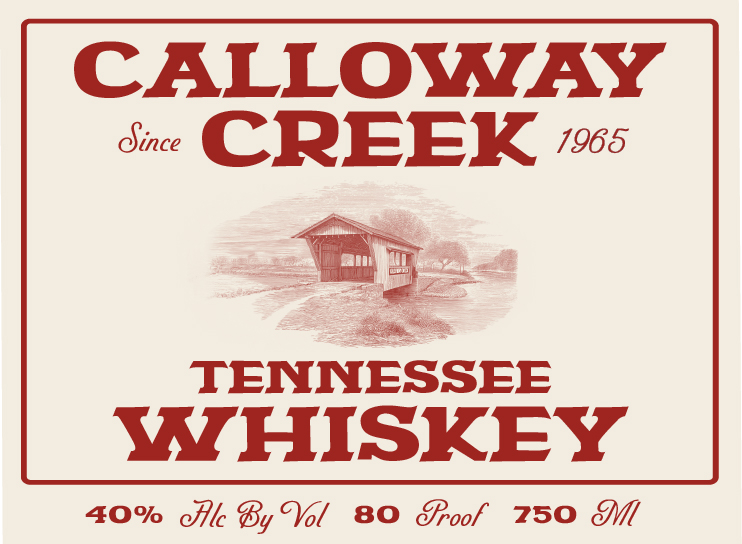
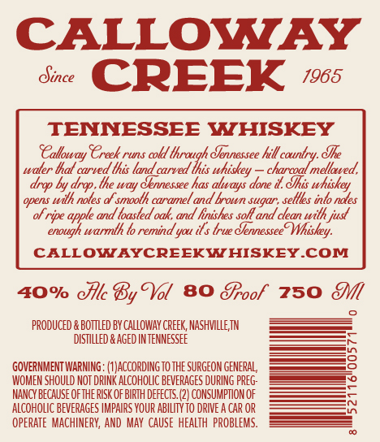

# TTB COLA Label Images - TTBID 26195001000680

**Brand Name:** CALLOWAY CREEK

**Issue Date:** 07/23/2026

**Origin Code:** 43

**Product Class/Type:** 140

**Source:** [TTB Public COLA Registry](https://ttbonline.gov/colasonline/viewColaDetails.do?action=publicFormDisplay&ttbid=26195001000680)

## Label Images

### Back Label

### Front Label

## Extracted Label Text

*Text extracted via OCR - may contain errors*

### Back Label

CALLOWAY

EER ws

=

La

TENNESSEE

ite

MIHISKEY

40% Ale By Vol 80 Sroof 250 Sl

### Front Label

CALLOWAY
Oince
CREEK
1965
TENNESSEE WHISKEY
SCalloway Treek s
runs
coldl lhraugh Jennessee hill country. Jke
waler hal carved lhis land carved Ihis whiskey
charcoal mellaved,
drop by drop , lhe way &ennessee has always done i.Jhis whiskey
opens Wilh noles &f smoolh caramnel
brown sugar ; sellles inlo nales
of ripe
and loasted oak; and hinishes solt and clean wilh just
enough
warmlh lo remind yau ils true JernesseeT Whiskey:
CALLOWAYCREEKWHISKEYCOM
4O% cllc By Tol 80 8roof
750
pRODUCED
BottLeD BY CALLOWAY CREEK, NASHMLLE TN
distLLeD & AGEd INTeNNESSEE
GOVERNMENT WARNING: (#JACCORDING TO ThE SURGEON GENERAL
WOMEN SHOULD NOT DRINK ALCOHOLIC BEVERAGES DURING preG;
NANCY because ofthe RISK OF BIRTH defects: (2} CONSUMPTION OF
aLCOHOLIC BEVERAGES IMPAIRS YOUR ABILTYtO DRIVE a CAR OR
opeRATe  MACHINERY, AND  MaY CauSe  heaLTH  PROBLEMS,
and &
apple =
