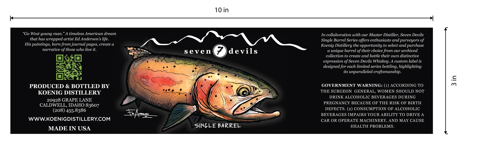
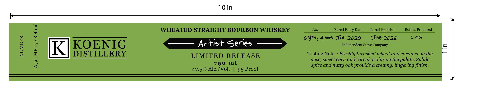

# TTB COLA Label Images - TTBID 26195001000775

**Brand Name:** SEVEN DEVILS

**Fanciful Name:** ARTIST SERIES SINGLE BARREL

**Issue Date:** 07/29/2026

**Origin Code:** 18

**Product Class/Type:** 101

**Source:** [TTB Public COLA Registry](https://ttbonline.gov/colasonline/viewColaDetails.do?action=publicFormDisplay&ttbid=26195001000775)

## Label Images

### Label 1

### Label 2

## Extracted Label Text

*Text extracted via OCR - may contain errors*

**Detected Proof:** 95
**Detected Age:** 6 Years

### Label 1

10 in
West young man
A timeless American dream
In collaboration with our Master Distiller , Seven Devils
that has wrapped artist Ed Anderson s life
Single Barrel Series offers enthusiasts and purveyors of
His paintings, born from journal pages, create @
Koenig Distillery the opportunity to select and purchase
narrative of those who live it
Seven
devils
unique barrel of their choice from our archived
collection to create and bottle their own distinctive
expression of Seven Devils Whiskey:
A custom label is
designed for each limited series bottling, highlighting
its
unparalleled craftsmanship.
PRODUCED & BOTTLED BY
GOVERNMENT WARNING: (1) ACCORDING TO
6
KOENIG DISTILLERY
THE SURGEON GENERAL, WOMEN SHOULD NOT
DRINK ALCOHOLIC BEVERAGES DURING
20928 GRAPE LANE
PREGNANCY BECAUSE OF THE RISK OF BIRTH
CALDWELL, IDAHO 83607
(208) 455.8386
DEFECTS. (2) CONSUMPTION OF ALCOHOLIC
+4
BEVERAGES IMPAIRS YOUR ABILITY TO DRIVE A
WWWKOENIGDISTILLERYCOM
CAR OR OPERATE MACHINERY, AND MAY CAUSE
SiNGLE BARREL
HEALTH PROBLEMS.
MADE IN USA
"Go

### Label 2

10 in
]
WHEATED STRAIGHT BOURBON WHISKEY
Age
Barrel Entry Date
Barrel Emptied
Bottles Produced
6
Yrs) 4ms Jin. 2020
June 2026
246
1
#
K
KOENIG
Artist Series
Independent Stave Company
4
DISTILLERY
LIMITED RELEASE
Tasting Notes: Freshly thrashed wheat and caramel on the
nose, sweet corn and cereal grains on the palate. Subtle
1
750 ml
spice and nutty oak provide a creamy, lingering finish:
47.5% Alc:/Vol.
95 Proof
