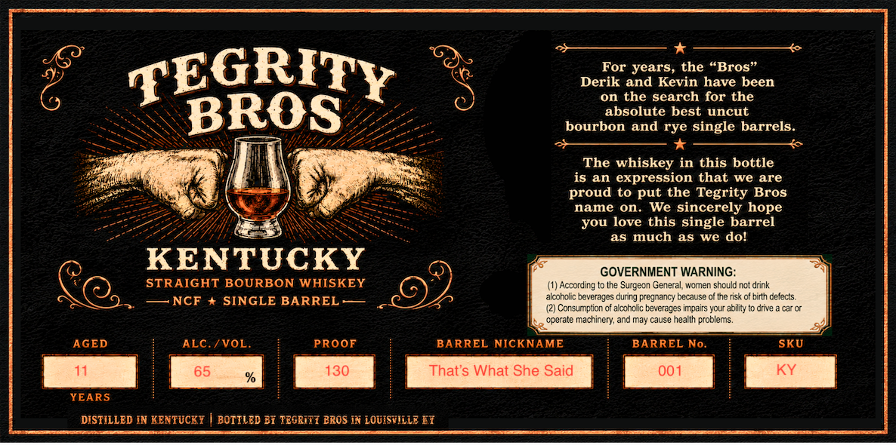

# TTB COLA Label Images - TTBID 26195001000862

**Brand Name:** TEGRITY BROS

**Issue Date:** 07/17/2026

**Origin Code:** 22

**Product Class/Type:** 101

**Source:** [TTB Public COLA Registry](https://ttbonline.gov/colasonline/viewColaDetails.do?action=publicFormDisplay&ttbid=26195001000862)

## Label Images

### Label 1

## Extracted Label Text

*Text extracted via OCR - may contain errors*

### Label 1

TEGRITY
For years, the "Bros"
Derik and Kevin have been
on the search for the
BROS
absolute best uncut
bourbon and rye single barrels:
The whiskey in this bottle
is an expression that we are
proud to
the Tegrity Bros
name on. We Sincerely hope
you love this single barrel
as much
as
we
dol
KENTUCKY
GOVERNMENT WARNING:
STRAIGHT BOURBON WHISKEY
According to Ihe Surgecn Genera
women shculd not drink
NCF
SINGLE BARREL
alcoholc beverages cuing Fregnancy because of Ihe risk of bitth cefects.
Consumption of alcoholic bevcrages impairs your ability to drive
caror
cperate machinery; and may cause heallh problems.
AGED
ALC
IVOL
PROOF
BARREL NICKNAME
BARREL No.
SKU
11
65
130
That's What She Said
001
KY
YEARS
DISTILLED IN KENTUCEY
BOTILED Bi TEgrit7 BROS IN LOuISvlile [7
put
