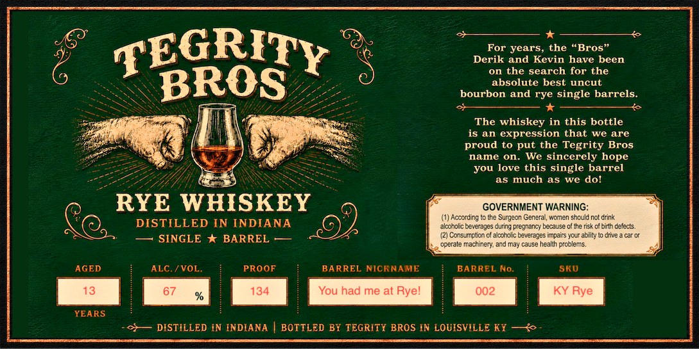

# TTB COLA Label Images - TTBID 26195001000866

**Brand Name:** TEGRITY BROS

**Issue Date:** 07/16/2026

**Origin Code:** 22

**Product Class/Type:** 142

**Source:** [TTB Public COLA Registry](https://ttbonline.gov/colasonline/viewColaDetails.do?action=publicFormDisplay&ttbid=26195001000866)

## Label Images

### Label 1

## Extracted Label Text

*Text extracted via OCR - may contain errors*

### Label 1

TEGRITY
years, the "Bros"
Derik and Kevin have been
on the search for the
BROS
absolute best uncut
bourbon and rye single barrels:
The whiskey in this bottle
is an expression that
we are
proud to put the Tegrity Bros
name on.
We sincerely hope
you love this single barrel
as much as
we dol
RYE WHISKEY
GOVERNMENT WARNING:
(1) Accord ng
the Surgeon Genzra , women shculd not arink
DISTILLED IN INDIANA
akonolic
beverages during pregnancy because of the nisk cibirth Gefects.
SINGLE * BARREL
(21 Consumpbicne
alcholic beverages impairs ycur at t
drive
car Dr
operale [
machinery; and may cause healih problems.
AGED
ALC / VOL
PROOF
BARREL NICKNAME
BARREL No:
SKU
13
67
134
You had me at Ryel
002
KY Rye
YEARS
DISTILLED IN INDIANA
BOTTLED BY TEGRITY BROS IN LOUISVILLE KY   &
For
